**ECSE 211, Winter 2026**  
**Professors B. Boulet and R. Bensalem**

# **Debrief Report – DPM Project**  **Version 1.1**  
***April 10th, 2026***

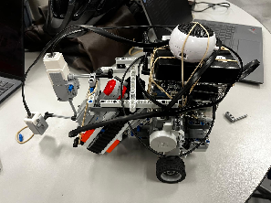

**”The Six Bricks™”**

**Team 19**   
Marny Brooker  
Zachary Chuang  
Ivan Gaspart  
Sasha Gelfand  
Jacob Sauvé  
André Savard

## Table of Contents

- **[1. Introduction](#1-introduction)**
  - [1.1 Team Overview](#11-team-overview)
  - [1.2 Team Composition, Roles and Capabilities](#12-team-composition-roles-and-capabilities)
  - [1.3 Team Contract and Organization](#13-team-contract-and-organization)
  - [1.4 Project Management and Milestones](#14-project-management-and-milestones)
  - [1.5 Budgetary Development & Resource Shift](#15-budgetary-development--resource-shift)
  - [1.6 Strategic Reflection: Hindsight and Future Design](#16-strategic-reflection-hindsight-and-future-design-for-future-teams)
- **[2. Specifications](#2-specifications)**
  - [2.1 Problem Statement and Scope](#21-problem-statement-and-scope)
  - [2.2 Design Requirements and Constraints](#22-design-requirements-and-constraints)
  - [2.3 Engineering Specifications](#23-engineering-specifications)
  - [2.4 Design Assumptions](#24-design-assumptions)
- **[3. Design](#3-design)**
  - [3.1 System Design Process](#31-system-design-process)
  - [3.2 Hardware Design and Evolution](#32-hardware-design-and-evolution)
  - [3.3 Software Design and Implementation](#33-software-design-and-implementation)
    - [3.3.1 Software Specifications and Initial Model](#331-software-specifications-and-initial-model)
    - [3.3.2 Design Iterations and Paradigm Shift: Multiprocessing](#332-design-iterations-and-paradigm-shift-multiprocessing)
    - [3.3.3 Final Software Architecture: Structure and Functionality](#333-final-software-architecture-structure-and-functionality)
  - [3.4 Design Iterations and Lessons Learned](#34-design-iterations-and-lessons-learned)
- **[4. Testing](#4-testing)**
- **[5. Performance](#5-performance)**
  - [5.1 Final System Capabilities](#51-final-system-capabilities)
  - [5.2 Performance Metrics](#52-performance-metrics)
  - [5.3 Use Cases and Limitations](#53-use-cases-and-limitations)
- **[Appendix](#appendix)**

# **1. Introduction**
## 1.1 Team Overview
*’The Six Bricks™’: Our philosophy.*

  

*Figure 1. Logo for The Six Bricks™.*

We are team 19 and one of our core team values is unity, striving together towards our common goals. Our logo features six interlocking bricks, one for each team member [(Figure 1\)](#figure-1). This represents how we, much like our final robot design components, hold each other up, since even one missing brick could cause system failure.  
Moreover, we strived to build and expand a common knowledge base. At the start of ECSE 211, we were individual “bricks,” raw materials with untapped potential. Throughout the design process, we merged and expanded our skillsets. By the term’s end, we no longer were separate pieces but rather a solid block, symbolizing the skills, experiences and machine we built together.	 In light of these guiding values, it is clear why the name ‘The Six Bricks’ clicked instantly. It was a unanimous decision because it so clearly captures how we plan to work together this semester.  
Our team elected to follow the structure described in the technical and workshop slides with a slight personal twist which functioned to foster accountability as well as reap the benefits of intellectual liberties. This dynamic was established early on as we agreed on positions that emphasized the levels of expertise that certain members had. From here management and overall functionality flowed fairly seamlessly. Certain team sub divisions naturally arose as managers and testing leads guiding the progress and made sure all members were aware of priorities. From this hardware, software and documentation were easy additions with all members aware of the restrictions we were working within. During the entire development of our robot ‘Ripper’ all members were actively participating in different subteams and subsystems. This aspect of the team dynamic allowed for greater overall perspective on various problems and thus enabled more well rounded solutions to problems we encountered. The project management and focus of certain work sessions was made significantly easier with the detail of our gantt chart. This feature made it clear for all members what needed to be done and or current position in the grand scheme of development. As far as overall team guidance went this was a very useful factor and aided the focus of our attention. This balance between structure and collaboration created a group dynamic that had guidance, accountability, and intellectual liberty. This set up made problem solving within the constraints practical and achievable.  

## 1.2 Team Composition, Roles and Capabilities

*The Six Bricks team members’ respective roles and responsibilities ([Table 1](#table-1)).*
*Capabilities:*  
When assigning roles within our projects, we must account for our members’ distinctive skillsets. Not only will this allow competent members to lead in their respective fields, but also for less experienced members to share the workload and acquire new skills from the veterans. The following table documents our self-assessed level in five selected fields associated with the project, rated on a scale from 1 to 5 proportionally to our confidence in the given field (see Table 1 in Appendix). GitHub was chosen as the fifth skill due to the primordiality of version control when it comes to large-scale, modular software projects.  
For the final project as well as for this deliverable we decided to structure our member responsibilities based on the common overall structure from design lecture slides. This includes roles such as; Project Manager, Documentation Lead, Testing Lead, Software Lead, Hardware Lead, and Software and Hardware Engineers. We elected to implement this structure because it provides fair distribution of responsibilities among each member tailored to their specific strong suits. As far as strictness for roles, we understand that some tasks may require more time, and we have unanimously agreed to participate in other required areas rather than restricting certain aspects to a select few. This balance between structured hierarchy of roles and contribution in all areas from various members allows for our group to attack problems we will be faced with from multiple angles, and overcome hurdles resiliently. The role division of this deliverable follows suit of the aforementioned group division. Certain members such as the project manager and the documentation lead contributed more to documentation, whereas design leads and engineers play a greater role in the idea development and the subsystem implementation sections.  
To get a better understanding of why such numbers in the [Table 25](#table-25)  of our appendix we need to quickly describe the previous experiences of all members, Marny the project manager works during summer in a “management” position in a real estate company where he spends time managing small teams which was obvious for him to be the project manager, Jacob Ivan Zach and Andre were all robotics club  members prior to McGill, Jacob and Zach tending more to the software aspect of robotics whereas Ivan and Andre specialised into hardware. Finally Sasha is well rounded; he participated in most subsystems and played an important role regarding documentation and testing, he was our swiss knife.

## 1.3 Team Contract and Organization
To optimize our workflow and ensure consistent progress, the team conducted a thorough analysis of individual schedules to identify optimal windows for collaboration. Based on these availability constraints, we established a primary weekly meeting on Tuesday mornings at 11:30 AM, which serves as our main synchronization point where all members are present. Following our weekly deliverables on Wednesdays, we meet with our Teaching Assistant (TA) to receive feedback and clarify technical requirements [(see Table 2\)](#table-2). These sessions are immediately followed by intensive lab work, where the team spends the majority of the day together to handle complex hardware integration and high-level planning. The remainder of the week is then structured around decentralized tasks, allowing members to focus on individual components or work in specialized sub-teams according to their specific technical responsibilities

*The Six Bricks™ Team Expectations Contract - ECSE 211, Winter 2026:*

The Six Bricks™ treat every lab and project deliverable as a professional engineering contract. Our collective goal is not merely to fulfill the minimum requirements for a grade, but to engineer a robust, repeatable, and high-quality robotics solution. We commit to maintaining a high standard of technical excellence and supporting one another in our professional growth as engineers.

Primary Medium: WhatsApp will serve as our official hub for daily updates, quick questions, and logistics.  
The Transparency Rule: If a member anticipates difficulty meeting a deadline or cannot complete an assigned task for any reason, they must notify the team immediately. We prioritize early communication to allow for collective problem-solving.  
Meritocratic Decision-Making: All ideas, whether related to mechanical design, sensor use, or software logic will be heard and discussed. Final design decisions will be made based on technical merit, feasibility, and empirical testing, rather than seniority or volume of voice.  
Availability: Members agree to respond to urgent team communications within a reasonable timeframe, respecting each other's schedules while ensuring project momentum and will contribute nine hours a week on the project.  
Equitable Contribution: Every member commits to completing an equal share of the total workload. This includes a balanced distribution of tasks across hardware assembly, software development, and documentation.  
The "No Monopoly" Policy: To ensure a well-rounded learning experience, there will be no "monopoly of knowledge." We encourage members to rotate responsibilities so that everyone gains hands-on experience with the different aspects of the robotics workflow.  
Preparation: Members agree to attend all meetings and lab sessions prepared, having reviewed the necessary documentation or code in advance to maximize our time together in the lab.  
The "24-Hour Rule": To prevent last-minute technical debt, all deliverables (code, reports, and testing) must be "feature-complete" 24 hours before the deadline. This buffer is dedicated to peer review, debugging, and reformatting to ensure a polished final submission.  
Version Control: We will utilize Git/GitHub for all software collaboration. Every member agrees to follow best practices including descriptive commit messages and branch management to prevent code loss and ensure a clean, functional codebase.  
Peer Review: No significant portion of the project will be submitted without at least one other team member reviewing it for accuracy and quality.  
Mutual Respect: All interactions will be conducted with professional courtesy. Constructive feedback is expected and must be given and received with the goal of improving the project.  
Internal Resolution: Conflicts or disagreements will be addressed civilly and directly within the team first, focusing on finding technical or logical solutions rather than personal ones.  
Escalation: If an issue cannot be resolved internally or if a member feels uncomfortable, the team agrees to seek external guidance from a Teaching Assistant or the Course Instructor to ensure a fair and productive environment.  
Shared Ambition and Consistency (Shared Goal): We are committed to putting forth our absolute best effort from the project’s inception to its final delivery. Our team is united by a shared drive to exceed basic benchmarks, ensuring that our collective dedication and work ethic remain consistent and unwavering throughout the entire semester.  
Accountability and Resilience: In the event of a delay or performance issue, we prioritize transparent internal dialogue to find a constructive solution. The team will proactively redistribute tasks to cover any gaps, ensuring the project's timeline is never compromised. While we will escalate extreme issues to the instructor if necessary, the team possesses the maturity to absorb individual setbacks and will work collectively to ensure the project’s success is not impacted.  
The "Gold Standard" Deliverable(Shared expectation): Our ultimate objective is a fully autonomous robot that pairs flawless technical functionality with a polished, intentional mechanical design worthy of a 10/10 score. This commitment to excellence extends to our documentation, ensuring the final report is a professional-grade engineering manuscript that accurately reflects our technical rigor.

Signatures:

| Marny  | Jacob  | Sasha |
| :---- | :---- | :---- |
| Ivan  | André  | Zach  |

## 1.4 Project Management and Milestones
To maintain a consistent workload of nine hours per person, the team implemented a structured weekly cadence centered around the Wednesday TA briefing. This routine ensured that “The Six Bricks” remained responsive to the evolving technical requirements of the robot, “Ripper.”  
The primary synchronization point occurred every Wednesday at 12:00 PM in the Trottier Design Lab. Following the progress review with the TA, the team held a mandatory planning session to cross-reference feedback with current progress and recalibrate objectives for the upcoming seven days. Most development occurred within the DPM room, which allowed for real-time visibility into subsystem progress. By working in the same physical space, members could immediately identify who was working on specific hardware or software components, facilitating instant peer support. For asynchronous documentation and "emergency" troubleshooting outside of lab hours, WhatsApp served as the primary communication channel to prevent bottlenecks between formal sessions.  
Technical Management and Version Control Software integrity was managed through a rigorous GitHub workflow. The team utilized separate development branches for specific features (e.g., navigation, sensor logic) to prevent merging conflicts and code instability. Pull requests were only initiated once a feature was fully tested, ensuring that no large-scale software issues were introduced into the master branch. This granular approach ensured that every line of code was peer-reviewed before integration into Ripper’s final system.  
To manage the macro-view of the project, a master schedule was maintained using specialized project management software. This Gantt chart comprised 89 distinct tasks, explicitly mapping the project’s critical path and forward-linked dependencies. The chart was kept on a shared Google Drive, making it accessible to all members at all times for reference.  
The following figure provides a high-level overview of the project timeline and task distribution. To enhance readability, the Critical Path has been manually highlighted in red, replacing the standard hatching used by the software to ensure the primary project constraints are immediately visible.  
Each entry in the chart specifies the task name, the assigned team members, and the specific dependencies required for task initiation. While this figure serves as a summary of our workflow, a high-resolution, full-scale version of the Gantt chart is provided in [*Figure 16 - Gantt chart timeline for the DPM project*](#figure-16-gantt). This full-scale version offers a comprehensive view of the entire project duration and more granular detail for each scheduled phase.

Progress was further tracked via a shared Google Sheets log. Every member recorded their hours and specific tasks in real-time, providing transparency regarding the project's "man-hour budget." This data allowed the Project Manager to identify if a particular subsystem such as the navigation logic was requiring more investment than forecasted, triggering a reallocation of resources.  
The project also utilized a Timesheet system that operated in symbiosis with the Gantt Chart and Project Budget to ensure disciplined resource management. By meticulously logging individual contributions, the Timesheet allowed for real-time tracking of labor hours against the milestones previously established in the Gantt Chart. This integration enabled the team to identify discrepancies between estimated and actual effort, providing a feedback loop that kept the project on schedule. Furthermore, by quantifying human-hour expenditures, the Timesheet informed the Budget’s labor-cost analysis, ensuring that our most valuable resource “time” was allocated efficiently to meet the technical requirements of the design challenge.  
While the financial budget for parts remained stable, the "human resource budget" shifted significantly over the design weeks. Initially, man-hours were heavily front-loaded toward hardware construction and physical prototyping. However, as the mechanical assembly reached stability, the team executed a strategic pivot, reallocating the majority of collective hours toward software refinement and edge-case testing. This shift was essential to resolve the complexities of the autonomous navigation requirements and ensure 100% task completion by the April 10th deadline.  
For a team tackling this design problem in the future, several adjustments to the project management strategy are recommended:

- Expertise Balancing: While the "sub-team" structure worked well, recruiting or designating a dedicated "Integration Lead" earlier in the process would streamline the transition between hardware completion and software deployment.  
- Prioritization of Construction Quality: A future team should prioritize high-precision construction in the first two weeks. Initial prototypes that are "just good enough" often require total rebuilds later; investing more time in mechanical rigidity early on prevents software calibration issues in the final stages.  
- Refined Contract Clauses: Implementing a stricter "Internal Deadline" (48 hours before the TA briefing) would allow for more comprehensive dry runs of the robot, reducing the stress of last-minute troubleshooting during the weekly evaluations.

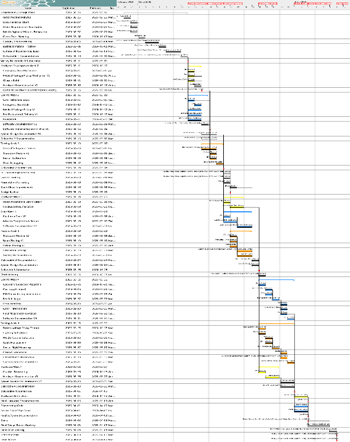  

*Figure 16. Gantt chart for the final DPM project. The timeline includes the start of the project from the first team meeting to the Final Report on April 10th.*  

---

## 1.5 Budgetary Development & Resource Shift
To ensure technical accountability and an equitable workload, every team member was responsible for logging their individual hours weekly in a centralized tracking system [(see Table 3 in Appendix)](#table-3). This shared Google Sheet provided a data-driven overview of the project’s progress, allowing the team to dynamically adapt the Gantt chart based on actual man-hours completed. To maximize the utility of lab sessions, Sasha, acting as the team secretary, prepared specific meeting agendas for the weekly consultations with the Teaching Assistant. This ensured that all technical hurdles identified during the week were addressed promptly, keeping the resource "spend" focused on solving critical path issues.  
The project budget was treated as a finite allocation of both physical components and collective man-hours. "The Six Bricks" opted to front-load the resource budget into an extensive initial design phase. By dedicating significant early-stage hours to achieving a "near-perfect" structural architecture for Ripper, the team created a robust physical foundation that simplified subsequent assembly. While this deliberate investment in mechanical rigidity and aesthetics required more time upfront, it prevented the need for costly physical redesigns later in the term.  
However, as the project transitioned into the final implementation phases, the inherent complexity of the software environment and sensor limitations necessitated a strategic shift in how resources were deployed. While the project began with a highly collaborative, "all-hands" approach to the initial design and assembly, the final two weeks saw a shift toward high-stakes specialization.	  
In this final "all-hands" pivot, the team dynamic transitioned from general collaboration to targeted execution. Each member identified the specific subsystem where their expertise was most impactful, whether in PID tuning, navigation logic, or hardware debugging. Each member focused their energy entirely on those domains to ensure the best possible product. Even members in management and documentation roles reoriented their efforts toward rigorous field-testing and debugging. This strategic specialization in the final 14 days was the deciding factor in ensuring Ripper could reliably pass every functional benchmark for the April 9th demonstration, proving that while a team may start the design process together, the final delivery often relies on the precise application of individual strengths.

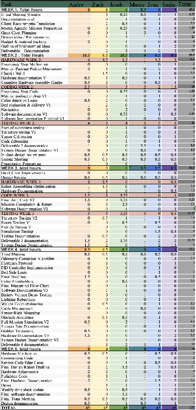  

*Figure 17. Comprehensive Project Budget Expenditure Log (Weeks 1–5).*

## 1.6 Strategic Reflection: Hindsight and Future Design for Future Teams
Reflecting on the development of 'Ripper,' our team concluded that the most critical phase of any robotics project is establishing an uncompromisingly reliable physical foundation. We advise future teams that a rigid, durable chassis, specifically one that securely houses the BrickPi and provides vibration-free mounting points, is not merely a design choice, but a prerequisite for software success. We discovered that sensors only operate with peak efficiency if their mounting is stable and the battery fully charged; without a rigid frame, even the most sophisticated software becomes prone to cumulative error.  
A significant technical "pivot" for a future iteration would be the abandonment of hardcoded navigation. While our current implementation provided the necessary precision for the specific lab environment, it lacked the flexibility required for dynamic obstacles or varied starting configurations.  
Our recommendation for future teams should prioritize a State-Machine architecture or a Dynamic Pathfinding algorithm (such as A* or Dijkstra) from day 1. Moving away from "if-then" hardcoding toward a more modular navigation stack would allow the software to be platform-agnostic and more resilient to physical perturbations.  
While the "No Monopoly" policy in our contract ensured everyone learned the basics, the complexity of PID tuning and Odometry suggests that a Strategic Shift in Expertise is necessary.We recommend appointing a dedicated lead early on to manage the nuances of sensor fusion and error correction. Beyond hardware and software leads, a future team would benefit from a "Systems Architect" whose sole job is to ensure that the mechanical constraints (e.g., wheel diameter, gear backlash) are perfectly aligned with the software's mathematical assumptions.  
If we were to restart the semester, our "Time Budget" would look significantly different: Front-Loaded Hardware: We would dedicate the first 15% of the timeline exclusively to stress-testing the chassis. A robot that falls apart during a 2:00 AM testing session is a software team’s worst nightmare.  
The "Hardware-in-the-Loop" Phase: We would prioritize a middle phase dedicated entirely to Integration Testing. Often, teams treat hardware and software as parallel tracks that meet at the end; we suggest they meet every 48 hours to prevent "Integration Hell."  
Our "Six Bricks™" contract served us well, but for a future project of this scale, we would add a "Peer-to-Peer Debugging Clause." We found that the person who writes the code is often the worst person to debug because they are blind to their own logical assumptions. The change would be for future contracts to mandate that "Sub-team A" must attempt to run and break the code of "Sub-team B." This internal "Red-Teaming" would identify edge cases such as sensor saturation or battery voltage drops long before the final demonstration.  
Final Takeaway: The success of 'Ripper' was built on consistency, but its successor should be built on abstraction. By moving from a "fixed solution" mindset to a "robust system" mindset, future teams can spend less time fighting their robot and more time optimizing its performance.

---

# **2. Specifications**
## 2.1 Problem Statement and Scope
*Outline of the Problem:*   
In response to high staff workloads and the increasing demand for reliable internal logistics in clinical environments , The Six Bricks™ has been tasked with developing an Autonomous Smart Hospital Assistant Robot. The objective is to engineer a prototype capable of executing a fully autonomous medical delivery mission within a 1.2 m x 1.2 m simulated hospital map (See [figure 33](#figure-33)) without any human intervention.

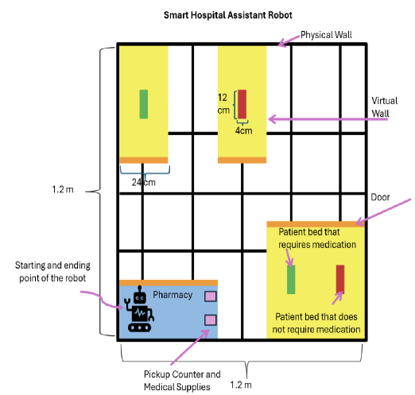  

*Figure 33. Simulated hospital environment layout (1.2 m × 1.2 m map).*

The mission scope requires the system to:

- Initialize and Collect: Begin at a pharmacy "Blue Tile" and use a custom mechanical design to securely pick up foam cube medical packages.  
- Navigate and Identify: Traverse hospital corridors and 24 cm doorways to detect specific patient rooms marked by "Yellow Tiles".  
- Evaluate and Deliver: Utilize onboard color sensors to scan bed indicators, accurately differentiating between patients who require medication (Green stickers) and those who do not (Red stickers).  
- Verify and Return: Successfully deliver two required packages while providing auditory confirmation, finally returning to the pharmacy to terminate the mission within a strict 3-minute time limit.  
    
  The system is implemented using the LEGO BrickPi platform. This project serves as a proof-of-concept for healthcare logistics, demonstrating that a reliable, repeatable solution can be engineered using a restricted set of motors and sensors while strictly adhering to safety 

constraints, such as the inclusion of a manual emergency stop.

*In Scope*: The technical focus of this project centers on the development of a functional prototype capable of executing a fully autonomous medical delivery mission within a simulated healthcare environment. A primary component of this scope is the implementation of precise autonomous navigation throughout a 1.2 m×1.2 m hospital map, which requires the system to navigate physical corridors while respecting both physical and virtual wall boundaries. The mechanical scope includes the secure acquisition of two foam medical packages from a designated pharmacy pickup counter and their stable transport to delivery zones without dragging or dropping the items. Furthermore, the robot must demonstrate sophisticated sensor-based decision-making by utilizing onboard color sensors to identify patient rooms (yellow tiles) and accurately distinguish between green and red bed indicators to determine medication needs. These operations are conducted under a strict time-critical constraint, requiring the mission to be completed in its entirety within a 180-second window. Finally, the scope includes essential safety integration through a manual emergency stop mechanism designed to immediately terminate all robot movement and actions.  
*Out of Scope:* To maintain a rigorous focus on the core proof-of-concept objectives, several advanced features have been explicitly excluded from this design phase. Notably, the system is not engineered for dynamic obstacle avoidance; while it must avoid static walls, it is not designed to detect or react to moving objects, such as hospital staff or patients, within the corridors. Additionally, the prototype is restricted to single-level environments, meaning multi-floor navigation involving elevators or ramps is outside the current technical requirements. Although the robot utilizes distinct sounds for delivery notification, more advanced human-robot interaction such as complex user interfaces for patient verification is not part of the system architecture. The design also assumes a high level of environmental stability, specifically a flat, even surface and consistent indoor lighting, and thus does not account for real-world environmental variability. Lastly, all forms of wireless teleoperation or remote control are strictly out of scope to ensure the system adheres to the requirement for 100% autonomous operation without human intervention.

## 2.2 Design Requirements and Constraints
*Provided Functional Requirements:*   
The robot must satisfy the following functional requirements [(ID meaning in Appendix)](#table-24) :[Table 2 - requirements](#table-2)

- (for our robot we decided to pick up two which reduced the complexity of the navigation; this is not a requirement but rather a design decision).   
- A mechanical pickup mechanism must exist to securely hold the packages during navigation and move them without dragging.  
- It must avoid collisions with walls (physical and virtual) 

*Provided System Constraints:  [Table 3 - constraints](#table-3)*

Additional Unexpressed Requirements :

1. Cable Management & Safety: All electrical leads and sensor cables must be routed internally or secured using LEGO-compatible fasteners. This prevents snagging on corridor walls or entanglement within the grabbing mechanism’s moving parts during high-speed maneuvers.  
2. Structural Dynamic Stability: The robot’s Center of Gravity (CG) must remain within the wheelbase footprint at all times, including during maximum acceleration with two medical packages. This prevents "nose-diving" or tipping when the robot stops abruptly to avoid a wall.  
3. Error Recovery (Soft-Reset): The software architecture must include a "watchdog" or recovery state. If a sensor fails to detect a line within a 2-second timeout, the robot must execute a localized search pattern rather than continuing into a collision.  
4. Serviceability (Battery Access): The chassis design must allow for a "hot-swap" of the battery pack in under 60 seconds without requiring the disassembly of the main structural frame or the removal of sensors.  
     
   Additional Unexpressed Constraints  
     
1. Ambient Noise Interference: The "Mission Complete" auditory signal is constrained by the lab's ambient noise level ~ 60 dB. The speaker output must be calibrated to be clearly audible to staff over the sound of other robots and cooling fans.  
2. Odometry Slip Tolerance: The friction coefficient of the specific floor tiles introduces an inherent constraint. The software must assume a 3% to 5% error margin in "dead reckoning" due to wheel slippage during rapid 90∘ turns.  
3. Mechanical Gear Backlash: Using standard LEGO gears introduces an inherent "play" or backlash of approximately 1° to 3°. This creates a physical constraint on the precision of the grabbing arm, requiring a "wide-mouth" design to compensate for mechanical inaccuracy.  
4. BrickPi Processing Latency: The Python-based control loop on the BrickPi is constrained by a specific sampling frequency (approx. 20 Hz to 50 Hz). This limits the maximum safe velocity of the robot, as driving too fast would result in the robot "over-shooting" a color tile before the sensor data is processed.  
   

## 2.3 Engineering Specifications
The system must adhere to the following technical specifications to ensure mission success:  
     
1. Chassis Width: The robot width must not exceed 20.0 cm. This provides a 4.0 cm total clearance (2.0 cm per side) to account for odometry drift when passing through 24 cm doorways.  
2. Rotational Clearance: To allow for a zero-point turn within a 24 cm corridor without striking walls, the robot’s maximum diagonal dimension must be < 24.0 cm. Assuming a width of 18 cm, this restricts the length to approximately 15.8 cm.  
3. Storage Volume: The internal "Ripper" magazine must maintain a minimum volume of 250 cm3 (10×5×5 cm) to securely house and dispense two stacked foam cubes without mechanical interference.  
4. Maneuverability: The robot must achieve a turning radius of 0 cm (true zero-point turn) using a differential drive system to navigate the tight 90∘ corners within patient rooms.  
5. Sensor Reliability: The color sensor must achieve a hit rate of > 95% across 50 trials for all five target colors (Blue, Yellow, Green, Red, and Floor-Grey) under variable indoor lighting (300 – 500 lux).  
6. Operational Velocity: To complete the mission within 180 seconds, the robot must maintain a nominal travel speed of at least 15 cm/s on straightaways, allowing for sufficient time buffers for sensor scanning and delivery maneuvers.  
7. Positioning Precision: Upon detecting a "Green Bed" indicator, the robot must stop with an error margin of ≤ ±1.5 cm relative to the center of the indicator to ensure the cube makes physical contact with the target zone.  
8. Ultrasonic Sampling Frequency: To prevent collisions at a speed of 15 cm/s, the ultrasonic sensor must provide distance data at a minimum frequency of 10 Hz, allowing the software to trigger an emergency stop within 1.5 cm of an unexpected obstacle.  
   

## 2.4 Design Assumptions
*Assumptions and Uncertainties:*  

To ensure the "Ripper" system operates within its intended performance parameters, the following boundary conditions and assumptions were established. These represent the environmental and operational constants that guided our software logic and mechanical tolerances.

Environmental :

1. The mission environment consists of a level, flat surface with a high friction coefficient, ensuring that wheel slippage is negligible and odometry remains a reliable source of truth for positioning.  
2. Ambient lighting in the testing and demonstration area is assumed to be stable (within the 300–500 lux range). Sensor thresholds for red, green, blue, and yellow detection are calibrated to these nominal conditions.  
3. Physical walls and doorway widths (24 cm) are assumed to be rigid and accurately placed according to the 1.2 m x 1.2 m map specification.  
4. The designated travel corridors are free of unexpected debris or dynamic obstacles, allowing the robot to execute its hardcoded pathing without the need for active obstacle avoidance.

Operational and Hardware Assumptions

1. It is assumed that the motor and sensor calibrations, specifically the PID constants for turning and the color sensor RGB thresholds remain consistent with the values recorded during the final 24-hour pre-deployment testing phase.  
2. The portable battery supply is assumed to maintain a voltage level sufficient to complete the 180-second mission without a drop in motor torque or sensor sensitivity.  
3. The mission begins with the robot at a predefined "Home" coordinate (x=0,y=0) with a heading error of less than ±1∘.  
4. While the mission is 100% autonomous, consistent local Wi-Fi is assumed for the sole purpose of real-time data logging and remote terminal monitoring during the execution.

Key Uncertainties

1. Sensors do not present defects on the day of the demo that are out of our reach   
2. primary uncertainty exists regarding the exact placement of beds near doorways. While specifications state beds are at least 1 inch from walls, the exact distance from the orange doorway markers is unconfirmed, necessitating a conservative "approach-and-scan" software buffer to prevent collisions during delivery.  
3. There is an inherent uncertainty regarding the "wear and tear" of LEGO mechanical joints over repeated trials, which may introduce minor mechanical backlash in the grabbing mechanism.  
   

The team dedicated significant effort to refining these technical details to eliminate any ambiguity in the initial design phase. We recognized that failing to identify a requirement early would inevitably lead to costly, late-stage design changes that could jeopardize our timeline. By establishing this rigorous baseline as a collective, leveraging the "more voices the better" philosophy we ensured that every member of The Six Bricks was aligned on the project’s trajectory. This collaborative planning phase proved to be the most crucial investment of our time. It served as our primary defense against technical debt, allowing us to move from the architectural phase to a functional prototype without the need for late-stage pivots or costly mechanical redesigns."

---

# **3. Design**
## 3.1 System Design Process
Phase 1 Subdivision: In order to more easily generate numerous original ideas, we first divided the ideation process into decisions regarding three categories, each representing a subsystem of the robot. Because these subsystems are largely independent in both their mechanical and electronic implementations, they were considered separately. The three categories were: a) the drive system, responsible for the robot’s locomotion; b) the cube-grabbing mechanism, responsible for interacting with and manipulating cubes; and c) the vision system, responsible for detecting and locating relevant objects, and understanding the robot’s own position in the environment.  
This subdivision allowed for a more organic, “spitball”-style approach to ideation, as a complete conceptualization of the final robot was no longer an immediate prerequisite to proposing potential implementation.

Phase 2 Refinement: Next, these initially abstract lists of contender designs, each summarized by a one-sentence description or short, identifying label, were verbally discussed and refined. Designs that were incompatible with the previously-established project requirements and constraints were removed, as were concepts that appeared unnecessarily complex or impractical.  
The remaining feasible ideas were then documented more thoroughly. Each concept was accompanied by a short paragraph describing its key characteristics, a sketch illustrating the intended structure and behavior, and a pros-and-cons decision table. Rather than using algebraic weighting, each design was evaluated across several criteria using a simple, qualitative scoring system:

Positive impact: +1  
Neutral impact: 0  
Negative impact: −1

These criteria reflected considerations such as mechanical simplicity, implementation feasibility, expected reliability, and overall system integration. This scoring method allowed the team to quickly compare candidate implementations while keeping the evaluation process straightforward and transparent 

Phase 3 Integration : Finally, the scores and discussions surrounding each design informed a group debate regarding the desirability of the remaining options. After considering both the decision table evaluations and the individual strengths and experiences of team members, a democratic vote was held to select the most promising direction for each subsystem. Following the selection, the preliminary specifications, functional behavior, and interactions of the chosen designs were documented. This provided a clear starting point for implementation and integration during the upcoming lab sessions.

**Phase 1 - Initial Ideas:**  
Our initial group brainstorm was documented in mindmap form on a chalkboard, and resulted in the generation of various subsystem design ideas and potential final robot possibilities. Of these, some were immediately eliminated for various reasons including impractical or impossible mechanical implementation, unnecessary complexity, or exceeding input/output port budgets. All selected designs will be explained in detail in phase two, except for eliminated ones, coloured in red:

1. Drive System (3)

X  | *Car Steering with axle and differentials |* Skid-Steering  
 

2. Cube Grabbing Mechanism(6)  
   Single-Block Pincher | Double-Block Pincher | Conveyor Belt Intake | “Tumbler” Rotating Cylinder Cube Collector | *“Dump truck” cube storage | Two-block, two-motor grabber*

3. Vision System (4)   
   Colour Sensor with Ultrasonic Sensor | Colour Sensor with Gyro | Colour Sensor with hard-coded initial rotation AND position | *Moving Gyro (scanning style)* 

   ***Figure 1 -** Documentation of the initial group “spitball” brainstorm in the form of a series of mind maps.*

1. Subsystem Design Ideas  
1. Smart Emergency “STOP”  
   Description: The Python code controlling the instrument is equipped with an exit condition within its main loop. When a button, fashioned out of a touch sensor, is pressed, the exit condition is verified, halting all outgoing control signals from the BrickPi and thus bringing the system to a complete halt.  
2. Tank Drive System  
   Description: Two motors spin a tank driving system. To make a turn, one belt spins forward while the other spins backward, turning the treads in opposite directions to induce rotation.   
   Sketch:  
     
3. Skid-Steer Drive System  
   Description: Driving system with two separate wheels. To make a turn, one wheel spins forward while the other spins backward. The ball bearing ensures that the robot maintains ideal balance.   
   Sketch:  
     
4. Single-Block Arm  
   Description: A grabbing mechanism employing two (2) motors to ensure the grabbing/dispensing of one (1) foam cube at a time. One motor is used to rotate a “claw” to “pinch”/release a foam block, while the other raises/lowers the arm to prevent the block dragging against the ground during transport.  
   Sketch:  
     
5. Conveyor Belt Grabber  
   Description: Two treads turn in opposite directions to grab (see direction labeled ‘1’) or dispense (direction ‘2’) foam cubes, which are then stored within the mechanism itself in a fashion evocative of a magazine. This design can also be achieved using a single tread rotating against a static “wall” on the other side, in order to free up wheels for the drive subsystem.  
   Sketch:  
     
6. “Tumbler” Block-Grabber  
   Description: A mobile, wide, L-shaped LEGO “scooper” rotates using an NXT motor to “scoop” foam cubes onto a static, L-shaped “shelf.” Blocks can be dispensed by rotating the scooper in the opposite direction, allowing the cube to tumble out.  
   Sketch:  
     
7. Vision Subsystem  
   Description: Between two (2) and four (4) sensors operate in parallel to ensure that the robot receives feedback regarding the current system state: a touch sensor acts as the emergency stop, polling for emergency shutdown input; a color sensor allows for patient bed classification and/or the use of a line-following navigation algorithm; a gyro sensor allows the robot to know its orientation to better locate itself within the map; and a strategically-angled ultrasonic sensor provides information on distance to the external walls to a similar avail. The gyro and ultrasonic sensors can each be replaced by simply hard-coding based on an initial position and orientation, if desired, allowing for 22=4 possible total sensor combinations, i.e. four possible “vision” setups.  
   Sketch:  
     
     
2. Full System Design Ideas  
   *The following designs employ the previously-described subsystems in various combinations. Please refer to section I, subsystem design ideas, for more details regarding their workings and/or structure.*  
1. “Crane”  
   Sketch:  
   Description: A tank drivetrain with a single-block arm grabber design. A “box” made of LEGO is used to store a single foam cube, in the case where the robot would need to transport two cubes simultaneously. Only the color sensor is used for navigating rooms and detecting beds/floors. A touch sensor is used for emergency stop.   
   Decision Table: (pro/con/neutral)  
   The decision table can be found in the appendix: [Table 4](#table-4)   
     
2. “Woodchipper”  
   Sketch:    
   Description: A skid-steer drive system with a conveyer belt grabber design. Ultrasonic and color sensors are used for navigation (ultrasonic used for detecting walls, color used for line-following and detecting room/floor changes). A touch sensor is used for the emergency stop.   
   Decision Table: (pro/con/neutral)  
   The decision table can be found in the appendix: [Table 5](#table-5)

3. “Frank”  
   Sketch:  
     
   Description: A skid-steer drive system with a tumbler grabber design. Gyro, ultrasonic and color sensors are all used for navigation (gyro for detecting robot angle with respect to initial orientation, ultrasonic for detecting external wall distance to know location within box, color used for line-following and detecting bed color and doors). A touch sensor is used for the emergency stop.  
   Decision Table: (pro/con/neutral)  
   The decision table can be found in the appendix: [Table 6](#table-6)

   

   **Phase 3 - Decision and Final Rationale:**

   

After carefully reviewing each of our decision tables, it is with unanimity that we agreed to choose the “Woodchipper” design. Indeed, its overall score was the maximum of the three and most importantly, we found it to be the most reliable design, leaving the least possible amount of room for bad surprises on demo day.

Key Features: 

- The conveyor belt rig: grabs, stores, drops off foams cubes accurately and effectively.   
- The wheel driving system: allows 90 degree turns, which is very useful in an environment full of right-angled borders like the patient room borders, etc.   
- The color/ultrasonic sensor pair: allows data collection of floors, walls, foams cubes. With the correct software implementation, this is the perfect sensor pairing as both are extremely reliable as seen in lab 1.   
    
  I/O Devices: (nature & quantity):   
- Ultrasonic sensor (1)  
- Color sensor (1)  
- Touch sensor (1)  
- NXT motor (3)  
    
  Interactions:   
- The conveyor belt grabs, stores and drops off foam cubes.   
- The color sensor senses the colour of the wheel for possible room borders, colour of beds, colour of foam cubes  
- The ultrasonic sensor senses the presence of cubes, physical walls.   
- The wheel driving system navigates the environment as dictated by the code

## 3.2 Hardware Design and Evolution

*See also: [Full Hardware History](#detailed-hardware-history) in the Appendix.*

*Week 1:*   
Medicine Cube Grabber Design  
After substantial prototyping of the cube grabber designs presented in deliverable 1, a final design was made to pursue the “Conveyer Belt Grabber” design. This design uniquely allows us to independently grab and release each block, while still being able to hold them simultaneously, removing the need to return to the starting area to grab the second block. See [Figure 5](#figure-5), the first working grabber prototype based on the “Conveyer Belt Grabber” design idea. Limited resources forced an innovative solution to make both belts turn in trandem. The belts touch on one end, allowing rotation to transfer from one powered belt to the other.  
Testing of the first prototype, pictured in [Figure 5](#figure-5) revealed inconsistencies in reliability, primarily due to the shape of the grabber opening, and the tension of the rubber tracks holding each block. While the shape and design were kept, additional tweaking of tolerances and tensions were made. Additionally a motor was mounted to begin testing. The current motor placement revealed that its weight over the front is an issue for the stability of the vehicle, and is causing excess flex in the mount between the grabber and the chassis. In future revisions, the motor will likely be moved up and behind the arm to better distribute weight.  
After preliminary testing proved the design feasible, it was decided that an initial full system integration would be constructed. Software for the grabber, however, had not yet been developed, due to its extremely recent design and a current refactorization of our codebase. A second iteration of the grabber was implemented to be more robust, and more compact, seen in [Figure 6.](#figure-5) This iteration was far more effective, both performance and space efficiency-wise. This was the version used in the final integration of our robot. 

*Figure 5. Original grabber prototype. Figure 6. New compact grabber.*

Chassis Design  
The size and weight of the grabber mechanism combined with the brickpi revealed the need for a taller, stronger, and extremely robust chassis. Our initial prototype was an implementation of “Skid Steer Drive System”, however left no room for the attachment of the grabber. Our prototype was subsequently scrapped, and a new chassis was built (see [Figure 8](#figure-8), grabber attached to a new stronger, taller, wider chassis. This chassis was specially designed by I. Gaspart to minimize flex under load.)  
Earlier chassis prototypes utilized the BrickPi itself as the primary chassis (see [Figure 3\)](#figure-8), to which the motors were directly attached, as was the case in our initial design sketch. This introduced substantial flex as the connections on the BrickPi are not sufficiently stiff under load. This led to the choice of building a separate, sturdy chassis as a base for the robot, entirely out of lego pieces. This can be seen in the bottom left of [Figure 15](#figure-15), as a primarily grey structure. Additionally, the BrickPi was chosen to be attached vertically in our final integration, rather than the original horizontal, to allow for more space for the large grabber.

*Week 2:*   
Summary of hardware changes:  
 In week 3, we focused on implementing the software necessary to run all of the subsystems for which we had built hardware for in week 2. Hardware design was therefore not changed significantly from the week 2 initial full system design, resulting in Hardware Version 1.1. Once final testing begins in week 4, any need for additional hardware changes will reveal themselves, but this configuration includes all mechanisms necessary to complete our tasks.   
As a summary, V1.1 utilizes a sturdy skid steer chassis, a belt conveyor grabber mechanism, and a “sweeper” color sensor subsystem which sweeps the color sensor across the area in front of the grabber to locate beds and determine their need for medicine. This can be seen in [Figure 3](#figure-3).  

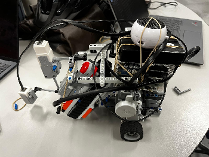

*Figure 3. Full system implementation (Hardware V1.1).*

Other various small issues were fixed, such as securing the battery onto the back of the robot as seen in Figure 3. Additionally, the speaker was briefly attached to enable musical feedback when a bed in need of medicine was found. [Battery and speaker mount](#figure-4).

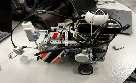

*Figure 4. Integration of the battery and speaker on top of the robot.*

*Week 3*  
Reflection on Beta Demo:   
The beta demo revealed major flaws in the hardware design of Ripper I (H1.1), particularly in terms of size and rigidity. Until this week, our robot was an integration of the prototypes of each subsystem, patched together in a manner that prioritized speed over construction quality and size. While this helped fasttrack initial software tests, in the long run, the poor construction quality slowed us down due to inconsistent driving and sensor readings. The largest issue was the size of the robot, significantly limiting our margin of error when entering rooms and scanning for beds, causing collisions with the walls. Additionally, the size prevented proper navigation near walls, especially in the starting area while attempting to grab both blocks. This led to the decision to completely rebuild each hardware subsystem and reintegrate them, so as to increase the stability of the robot, and decrease its size.

Hardware Design Evolution: [Figures 5 & 6](#figure-5)

Based on the data we collected during tests leading up to and during our full system demonstration in Week 3, we determined every hardware system needed an overhaul to reduce size and increase reliability. First, we designed a new grabber system, closely modeled after the original prototype (H 1.0) with which we had found good success. Improvements include: better mounting hardware, a more compact design, and a more ergonomic motor placement.

[Figures 7 & 8](#figure-5)

Similarly to our revised grabber, the new chassis closely resembles its original prototype (H 1.1). As the prototype's only major issue was its size, we decided to retain most of its characteristics, such as the ball-bearing-forward skid-steer drive train, and the color sensor subsystem attached to the front. To improve on this design however, we opted to intentionally design with verticality in mind. In our new design, this can be seen with the roof mounted BrickPi and battery. While the BrickPi might seem like the core of the robot at first glance, it is in reality, the component requiring and providing the least structural support, and it has no location constraints contrary to, for example, the grabber, which must be mounted in front. This led to the decision to implement it last, and to avoid increasing the length or width of the robot, it was placed on top. The battery was placed with weight distribution in mind.

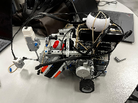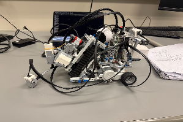

*Figure 7. New final integration. Note its verticality. Figure 8. Prototype integration.*

Detailed Hardware Design - Summary:  
Ripper is a medicine carrying robot that allows for the picking up of and delivery of two medicine cubes. The grabbing of these cubes is done by the Conveyor Grabber, which is a system of two near parallel tracks which grab and squeeze the cubes up into the conveyer. This subsystem is mounted at a ~45-degree angle on the front of the robot, to minimize the horizontal space it consumes, which is still effectively grabbing. The chassis utilizes a skid-steer motor system, consisting of two central mounted motors with wheels and a single front mounted ball bearing beneath the grabber. This results in smooth turns around a constant center of rotation. The heart of the robot is the BrickPi, a RaspberryPi-based controller, which allows us to program the robot’s behavior by directing and processing actuator and sensor signals. The large BrickPi is mounted above the center of the robot, to avoid enlarging the robot’s horizontal dimensions. Minimizing the length and width is key to allow for flexible navigation within the environment. The battery is mounted on top of the Pi (H 2.2), in a location that optimises weight distribution. Finally, the sensor and vision subsystem consists of three main components: color sensing and bed detection, emergency stop, and gyro sensor feedback. The gyro and emergency-stop touch sensor are mounted at convenient, easy to access locations on the left and right of the robot, respectively. For the bed detection subsystem, the color sensor is mounted on a small motor or “sweeper”, which allows the sensor to be swept left and right at approximately a diameter slightly smaller than the width of a room. This allows beds to be located without turning the robot. This subsystem is mounted on the grabber, and the very front of the robot, such that the color sensor hovers about a cm off the ground.  
To complement the physical design, a detailed 3D digital twin of “Ripper III” has been developed to accurately represent the robot’s structure, component layout, and subsystem integration. This model highlights the relationships between key elements such as the Conveyor Grabber, BrickPi, and sensors, providing a clear visualization of design decisions. It also serves as a tool for validating dimensions, optimizing component placement, and communicating the system architecture effectively. The following model illustrates the final iteration of the robot and provides a comprehensive view of its mechanical and functional design. [Figure 17 - digital twin](#figure-17).

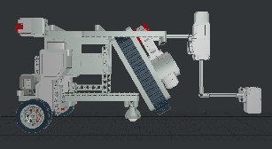  
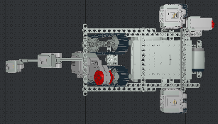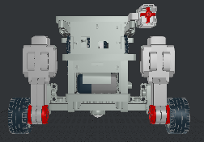  

*Figure 17. Digital twin of Ripper III modeled using LeoCAD. Note that the battery, speaker and motor/sensor cables could not be rendered in LeoCAD.*

## 3.3 Software Design and Implementation
The programs operating the Ripper system were developed in parallel with the robot’s hardware, as the integrated nature of the software required access to the physical I/O devices for testing and validation purposes.  
Development was done using the cross-platform model, as battery unreliability made in situ development risky for codebase health. Git and GitHub were utilised for both version control and transferring code from the respective developers’ local clients to the BrickPi system. To run tests and pilot the robot during testing and demonstrations, SSH tunneling was utilised.  
The following section will provide a detailed description of the software specifications derived from the provided requirements and the initial model thus derived, the paradigm shift to multiprocessing which ultimately defined the system, and the final architecture and behaviour implemented for the final product demonstration.

### 3.3.1 Software Specifications and Initial Model
After converting the functional requirements and constraints, both provided and implicit, into an overall, hardware-focussed system model (see [Section 2](#2.-specifications)), a set of software specifications was defined to guide the foundational prototyping and implementation phases. Below are an exhaustive list of thus-compiled specifications, grouped by subsystem when possible:

*Overall Software Specifications:* 

- Sleep/buffer times and mean execution times for all successive method calls must have a total summation T ≤ 180 seconds.  
- The codebase must be programmed in Python 3.9 and communicate with the RBPi’s GPIO pins using the provided utils.brick module.  
- The code must only utilise modules which compile and run on a RaspberryPi3B+ running “Stretch” (Debian 9).  
- The code must contain a main method which independently manages logic and successive instruction queueing/execution without soliciting user input.  
- The system must utilise the provided brick.Motor, brick.EV3ColorSensor, brick.EV3GyroSensor, and brick.TouchSensor classes to send/receive data from (respectively) the provided 1 EV3 medium and 2 EV3 large motors, the color sensor, the gyro sensor, and the touch sensor.

*Grabber Subsystem Specifications:*

- The program must have a _grab() command which actuates the EV3 ServoMotor at the exact right speed with the exact speed (dps) to pick up a block from the pharmacy counter and have space to pick up and store a second one.  
- The program must have a _dispense() command which actuates the EV3 ServoMotor at the exact right speed with the exact speed (dps) to drop a block stored inside the conveyor belt and still be holding a second one.

*Vision Subsystem Specifications:*

- The robot must be able to receive and process r,g,b color data produced by the EV3ColorSensor.get_rgb() function necessary to detect entry into patient rooms through orange doors.  
- The robot must be able to receive and process r,g,b color data produced by the EV3ColorSensor.get_rgb() function necessary to determine whether the bed(s) located inside a room is/are green or red without leaving the confines of the 24 cm wide rooms.  
- The robot must have a _turn(degrees) function allowing it to consistently, accurately and precisely perform turns through EV3 Large Servomotor actuation within +/- 3 degrees of cumulated accuracy, to be able to complete full map traversal and drop blocks accurately.  
- The robot must have a _go(distance) function allowing for it to complete straight-line motion over small (room scale) and large (map scale) distances specified in centimetres by utilising EV3 Large Servomotor actuation coupled with EV3 Gyro, EV3 Color, or EV3 Ultrasonic Sensor feedback for drift correction.

*Sound and Music Specifications:*

- The robot must have a “package delivery sound” function using the utils.sound module to play a tone through the connected speaker upon delivering medicine.  
- The robot must have a “mission complete sound” function using the utils.sound module to play a tone distinct from the previous one through the connected speaker upon completing the full mission.

*Emergency Stop Subsystem Specifications:*

- The program must have a master process, distinct or not from the instruction-parsing process, which uses TouchSensor.is_pressed() to detect manual emergency stop input at least 10x per second, halting all active processes immediately when it does.

Based on these specifications, we designed an initial, holistic software system model structured roughly as follows:

1. A main module runs a while loop which exits immediately upon Emergency Stop activation.  
2. Within this module, hard-coded instructions are loaded in at runtime from a pre-populated list.  
3. Each instruction and its internal logic is executed sequentially, soliciting Sensor/encoder inputs and producing Motor/speaker outputs when necessary.  
4. Upon mission completion or Emergency Stop code termination, the program halts, and reset_brick() is called to terminate outgoing signals and reset all encoders and sensor parameters before the next run.

This initial model was implemented as early as version S1.0.0, i.e. when the initial ‘discovery testing’ phase of development was over (e.g.: discovering the Large Servomotors, discovering the Gyro Sensor), and persisted in these broad strokes throughout the entirety of the design process. 

### 3.3.2 Design Iterations and Paradigm Shift: Multiprocessing
To produce the final system from the initial planning and prototyping phase, an iterative approach was adopted to produce code in tandem with advances in hardware development. Indeed, due to the code’s integrated nature, it was nearly impossible to test (save compiling it to uproot Exceptions) without a compatible hardware model. Therefore, it was decided that the bulk of new feature development would occur as new hardware enhancements rendered capabilities possible. For instance, grabber code would only begin being intensely developed past a function skeleton when a physical grabber was implemented, i.e. not before hardware version H1.0.  
The entirety of the software version history is contained within section 3.3.2 of the appendix for complete reference. Each entry is organised as follows:

- **Version number** SX.X.X  
- **Nickname/main feature**: Descriptive name for internal reference  
- **GH Commit**: Link to corresponding GitHub commit  
- **Reasons for iteration:** Issues/desired enhancements which led to the iteration being developed  
- **Description of additions**: Complete list of all changes made to the software in this iteration  
- **Overall functionality list:** Complete list of all major functionalities available in the system at this version, with additional details surrounding those added/modified in this specific iteration.

This format not only allows for rapid reference in case changes need to be reverted, but also provides exhaustive documentation allowing for any point in the history of the software to be: completely reversed using git reset -–hard [commit_hash], or partially reversed by manually reimplementing successful features in the ever-evolving framework. It is also useful to define the scope and relevance of particular tests conducted on a given software version.

The main paradigm shift which occurred during the design process, which was not simply a tweaking of the previously-detailed holistic sequential structure or an implementation of a functionality from the specifications, was the shift to a multiprocessing framework internally referred to as Megamind. As seen in [figure 18](#figure-18), it is organised according to processes, i.e. parallel operations managed by different CPUs, managed by the Python multiprocess library. These processes are themselves encapsulated into different helper classes, all subclasses of the Processor class, which manages individual instruction queues for each actuator, sensor, and even the Megamind controller/dispatcher class (see [figure 19](#figure-19)). 

### 3.3.3 Final Software Architecture: Structure and Functionality
The final structure of the software is depicted in the class diagram in [figure 18](#figure-18). The core classes present, along with their main features and uses, are:

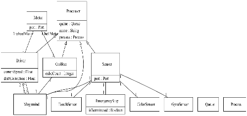  

*Figure 18. Class Diagram of final system architecture. Generated using umple-offline ([https://github.com/jacob-sauve/umple-offline](https://github.com/jacob-sauve/umple-offline)).*

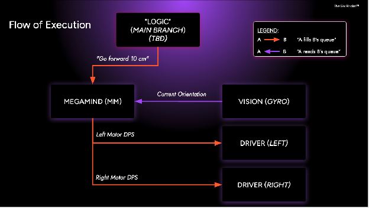  

*Figure 19. Example flow of execution from main method calling upon Megamind all the way until Motor/Sensor actuation via their respective wrappers.*

1. Megamind (MM)  
   1. Dispatcher/controller.  
   2. Reads the main instruction queue and:  
      1. Sends movement/actuation instructions to the motor queues based on system state (current and desired).  
      2. Polls sensor input queues for data to update internal system state.  
      3. Orchestrates subsystem interactions (between drive, vision, and grabber).  
2. Driver  
   1. Worker class for process management; one driver exists per wheel motor, and one for the grabber belt motor.  
   2. Translates movement instructions from MM into motor speed, start and stop commands.  
3. Sensor  
   1. Worker class for process management; one Sensor exists per input sensor used.  
   2. Continuously monitors input at specified frequency and pushes information to queues accessible by MM.

In terms of the behavioral architecture patterns in the Ripper software, they are centered on multiprocessing with multi-tiered, queue-based load leveling. The system is organized in multiple tiers: main.py acts as the request generator sending commands, Megamind.queue acts as the buffer, and Megamind acts as the request processor, transforming received commands into commands for the Drivers and Sensors, thus itself becoming the next request generator, Driver.queue the buffer, and Driver also the final request processor, converting instructions into Motor actions. In practical terms, this follows the flow:  
commands.txt → command parser → list of tuples → main.py → multiprocess.Queue containing tuples → multi_process_drive.Megamind manage_queue() loop → Driver (with information from Vision) → robot action

This architecture isolates parsing, coordination, and actuation responsibilities into clearly separated process levels, allowing for real-time feedback on actuator outputs all the while making code development and modification as easy as possible thanks to the plaintext command parser.

The main risk typically associated with queue-based load leveling is throttling, i.e. reaching a bottleneck where the instructions received are entering at a rate far superior to their actual execution. In this case, the delay between processing each instruction serves to create a sequential flow of instructions, rendering throttling a desired outcome rather than a liability. Indeed, Megamind serves one instruction at a time to Drivers, with low buffer time (0.005 seconds). The main throttling risk, however, exists outside of this main load leveling architecture, in Vision.queue. This structure is accessed periodically to synchronize saved and actual current system state (orientation, nearest color), and is updated asynchronously and continuously with extremely low buffer time, making stale readings being at the front of the queue a real possibility. This risk is mitigated by the Megamind.clearSensorQueues() method, which is called periodically to ensure that the front of sensor output queues reflects the current state of the system.  
On a broader scale, the system software architecture also reflects master-worker parallel processing and thread-pool variations of the Command pattern: main.py as client/invoker, parsed tuples as commands, and downstream driver/vision components as receivers. A parallel while-loop emergency-stop process provides an additional safety control path during runtime.

## 3.4 Design Iterations and Lessons Learned
The total design integration evolved substantially over the course of the 4 weeks the team spent developing “Ripper”, our medicine delivery solution. In Week 1, the initial selection of a hardware design idea was made, where we decided on the general solutions we'd implement for each subsystem. Before deciding on the hardware implementations, we prototyped two design ideas. One, was a claw mechanism that used one motor to both squeeze and pick up the block. The second, and conveyor belt method that pulled blocks up and into an angled conveyor grabber. After prototyping, we were unable to create a claw mechanism that remained small and reliable enough for implementation on our robot, however it was a proof of the concept. Due to the size constraints of the robot, we decided to pursue the conveyer grabber mechanism, which we had named “woodchipper”. Following this decision, we were able to begin designing the software that would power this system. Our first prototype came at the end of week one, in the form of a bare-bones skid-steer implementation, employing only a color sensor at the front. The purpose of this initial prototype was to experimentally test different software implementations, as well as the chosen skid-steer chassis, and to determine the feasibility of line following **(see [figure 15](#figure-15))**. Following the testing of this prototype, we determined that line following would not be utilized, as we were unable to achieve decent results, and found it unwise to pursue it long term in the chance that it may harm our solution’s success. Additionally, we noted that a software implementation that allowed instructions to be handled like a queue, would be necessary to streamline the process of navigation and task handling. This was particularly important due to our decision to essentially “hardcode” the navigation system from a constant starting point. While this method may seem unreliable, testing revealed it functioned reasonably well and reliability, as long as the battery maintains a constant output voltage. The decision was therefore made to prioritize implementation speed and to minimize complexity.

Moving into week 2, we began to pursue the first proper implementation of each subsystem, in preparation for a coming demo in week 3. The chassis was scrapped in favor of a new, sturdy chassis that could support the addition of the medicine cube grabber mechanism. The grabber mechanism itself was prototyped and built during week 2, however it was clear that the use of bent and flex lego pieces caused reliability issues over time, and would eventually need to be altered. Shown in **Figure 13**, our first full system integration properly employed every subsystem as they were intended, and testing began to verify the feasibility of our design, in case changes needed to be made before week 3. Through this integration, we noticed that contrary to previous belief, one of the most impactful constraints upon our design was the size limitations. The robot needed not only to be small enough to enter and exit rooms, as well as travel between them, but also to navigate within them, particularly to pick up and drop off blocks without hitting walls. This integration, while working well within the scope of individual subsystems, unfortunately infringed on our ability to navigate within the hospital setting. Software at this stage saw minimal changes in design method and philosophy, and rather work was primarily focused on increasing the scope of the actions and instructions the system could intake and execute. Software integration proved to be the most time consuming step, and at this stage, the focus was on having an instruction set enabling basic navigation and bed location.

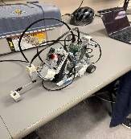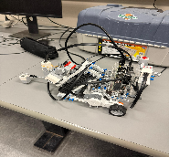

*Figure 13. First iteration of the final functional design of our medicine delivery robot.*

The Week 3 demonstration revealed major issues regarding the size of our previous implementation as well as the rigidity and reliability of the grabber mechanism. We noticed one factor that strongly influenced the size of the robot was the orientation of the motors powering the wheels. When implementing these motors horizontally such as in our previous iteration, we found that while it produced a very stable platform, it made it challenging to fit the navigation subsystem’s ball bearing, as well as to attach the grabber and the color sensor without making the overall system too long. Due to this reason, we decided to only consider hardware designs with vertically orientated motors, in an effort to decrease size. This was the first step towards a realization that designing with the vertical axis in mind was beneficial to our implementations, as there was no vertical size restraint. Referring to [Figure 15](#figure-15), we see vertical motors such that the grabber can fit much closer to the center of mass, reducing the size of the robot significantly. Additionally, the BrickPi and battery are placed centrally between the motors, again to maximize space efficiency. Finally, the grabber mechanism received an overall, decreasing its size, and reducing its reliance on the torsion tolerance of lego connections and pieces, thereby increasing its reliability. Up to this point, in the software instruction queue was implementation as a set of subsequent function calls to MegaMind. This method made it difficult to quickly test various subsystems and instructions, as each change required a code alteration, subsequent git commit, push, and pull, and then finally an execution of the .py file. To fix this, we implemented a new queueing method. A commanding parsing function was designed to take input from either a .txt file or the command line to add instructions to the queue for execution. This drastically sped up testing, and we strongly recommend a similar system be implemented early on in the design stage. This increased testing efficiency additionally helped us review problems faster. With our new design, we noticed the uneven weight distribution caused the robot to turn somewhat inconsistently. Additionally, while the redesigned grabber was a major improvement, its mounting hardware would periodically come loose due to the connectors orientations being parallel to the forces acting upon them.

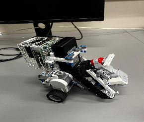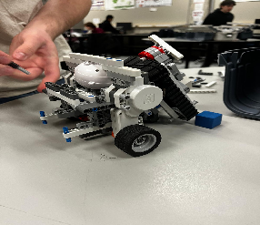

*Figure 15. Second version of the final integration model.*

Early in Week 4, we developed our final implementation. From **Figure 16** , we see that changes from the previous iteration include a redesigned grabber mount and a relocated battery and BrickPi, to even out the weight distribution. One unfortunate limitation we ran into during this implementation, was the number of lego connectors we had access to. Running out of these connectors meant we relied heavily on rubber bands to mount components that weren't critical to the stability of the chassis, and that had no need to be mounted precisely, such as the battery and speaker. Fortunately however, this caused zero issues in the stability or reliability of the robot and its crucial subsystems, and so the design was kept in favor of extra time for testing. An additional instruction set that allowed the robot to scan the large room was added to the software, and the robot was ready to begin calibration testing for the final demonstration and mission completion.

*Figure 16. Final iteration of our chosen robot design, with grabber, drive, and vision subsystems integrated.*

Reflecting on the design process, there were many limitations we encountered that we did not expect to impact us as significantly as they did. The first of these is the size and weight limitations of the full system and of individual subsystems. Knowing what we know now, we would pay closer attention to the size and stability of the design when in our initial design selection phase, and consider how different subsystems will need to connect together. Another major limitation was the number of connectors we had. In pursuit of a strong chassis, we ran out of connectors on quite a few occasions, requiring either redesigns or reliance on rubber bands. We believe an intelligent solution to this issue would be to properly budget the pieces each subsystem will require to build and then install, such that no subsystem is left missing pieces. On the software side, while our implementation promised extremely flexible operation and a large instruction set, all with low down time, the complexity at times harmed us. It is worth noting however that the majority of limitations we encountered while testing software were a result of the BrickPi python library that we were required to use as a base. A better analysis of this library and how we should use it could have minimized these problems.

---

# **4. Testing**
Testing was broken down into various levels allowing for a more in depth understanding of our components capabilities. This approach  starts with component testing making sure that we had a full understanding of how well the most important pieces of our robot functioned. The next layer of testing was broken down into specific subsystems tests where multiple components first began interacting with one another. From here testing system level integration came naturally as multiple sub systems came together and we developed a functional bot. All test procedures will be in the appendix.   
The first of our component level tests was for the motors. These tests were done by J. Sauvé and I. Gaspart, with written reports completed by S. Gelfand. This was an encoder test for all motors that compared recorded rotation with predicted encoded distance. In order to validate devices under test the actual rotational distance traveled was compared to a conversion of the encoded value. These calculations were made by first finding the actual wheel circumference. From here we then needed to find the distance traveled per single encoder count. This is done by dividing circumference by the total number of encoder ticks per revolution (720 found online). For finding the predicted distance traveled or recorded by the robot the simple calculation of multiplying distance per iterations by encoder iterations recorded. Then with this value it can be compared to the actual distance traveled and a gauge of accuracy can be determined. This test was run three times for each motor. The success criteria for this test sprung from the need for accurate and repeatable values, especially for map traversal. With this we elected for digital values of distance traveled to be within a 2cm buffer range from the actual recorded distance. The error for all three trials per motor were averaged and all average displacement from actual values were within the specified range [*Table 9*](#table-9) *- motor tests*. The average error for each motor also provided us with insight as to which specific motors might be better to use within a drive subsystem which would benefit from lower average error values. These findings aided us in design implementation and component selection. Moreover, such results guaranteed consistent and accurate performance from each motor allowing confidence in using the encoded values coming from each motor in practice.  

The gyroscopic sensor component tests were run similarly to the tests of the motors [*Table 10*](#table-10) *- gyro tests*. This procedure consisted of taking a starting position and physically rotating the sensor, then evaluating the processed digital values as well as recorded angular distance. In order to understand the fundamental accuracy and function of this component we elected to follow a similar approach to the motor tests, doing three trials of different rotations. This choice is to see how accuracy is affected over a larger range of rotation. There were no serious calculations that needed to be done for this test and the digital values from the gyro sensor are primarily processed as degrees in reference to its boot up location. This was performed in both directions, simulating both rotating clockwise and counter clockwise,  in order to establish if there was any noticeable effect in the direction of rotation.  From these recorded values we then were able to adequately establish an average error. We aimed for this to be within a two degree buffer zone of the actual angle of rotation. As can be seen in the test results this test revealed that there was a larger than expected average error that could affect overall traversal of the map. The flaw with the gyro sensor displayed that there was over estimation with rotating clockwise and under estimation when rotating counter clockwise. With this information at hand we proceeded by incorporating an overshoot/undershoot correction measure in the turning process. This measure alternated over shooting and undershooting in order to correct for the average error distance in the digital values. By doing so we were able to successfully record and establish accurate and repeatable turns to selected degrees.   

The next iteration of component level testing was completed for the touch sensors. This component is vital to an important feature of the robot: the emergency stop [Table 11](#table-11) *- touch sensor testing*. This procedure consisted of connecting each sensor to the BrickPi and actuating it manually, then evaluating both the reliability of input detection and the latency between physical actuation and the mapped software output. In order to understand the fundamental responsiveness and function of these components we elected to conduct two distinct sub-tests: a click reliability test and a speaker latency test. This choice was made to separately characterize the sensor's raw signal detection from the full input-to-output pipeline latency. The click reliability test was performed with both 10 and 25 input presses per sensor, verifying that the number of registered clicks matched the number of user inputs exactly. This was repeated across both sensors in order to establish whether there was any noticeable variance in mechanical response or signal detection between the two units. From these recorded values we were able to adequately confirm consistent and reliable input detection. We aimed for negligible latency between actuation and software registration, which was met in all click trials. The speaker latency test, however, revealed a larger than expected delay in the full pipeline, averaging approximately 775ms across all four trials. This delay was attributed to the speaker hardware itself rather than the touch sensor, as the sensor signal was confirmed to reach the BrickPi near-instantaneously. With this information at hand we were able to conclude that both touch sensors meet all reliability requirements, and that the observed latency is a hardware limitation of the speaker component rather than a deficiency in the sensor or software subsystems.  

The colour sensor subsystem tests were conducted in a structured manner to evaluate the accuracy and reliability of the newly implemented HSV-based colour detection code [Table 12 - RGB testing](#table-12) & [Table 13 - HSV testing](#table-13). These procedures involved placing the sensor over a target colour and running the detection code in debugging mode to observe real-time outputs of hue, saturation, brightness, and classified colour. For each colour, adjustments were made to saturation and brightness thresholds when detection was inconsistent or absent, and hue intervals were refined when misclassification or oscillation between colours occurred. Multiple trials were performed for each of the five target colours (blue, green, red, yellow, and orange), with continuous sampling over 10-second intervals to assess stability and consistency. Through this process, blue and green were both detected with near-perfect accuracy after minimal or no adjustment, while yellow initially exhibited misclassification as orange, requiring refinement of its hue interval. These iterative calibrations allowed for the progressive improvement of detection performance, aiming to achieve the target accuracy of 99.9%. The results demonstrate that careful tuning of HSV boundaries is essential for colour classification, and that small variations in hue ranges can significantly impact detection. This testing approach enabled the identification of interval values and highlighted areas requiring further calibration among similar colours, ensuring the subsystem moves toward consistent and accurate performance required for the robot’s operation.

[*Table 14 - sweeping bed detection test*](#table-14)

With component level testing complete the development of subsystems and subsystem testing began. This process utilizes the information and data collected from the component tests and aided our development of certain subsystems to perform the tasks required to succeed, within the limitations of the components which we had found.   
The cube management subsystem is vital to the overall success of this project and with that adequate testing measures were developed and integrated [Table 15 - grabber testing](#table-15). The grabber subsystem involves a single motor and various mechanical components form the DPM kit. The grabber subsystem tests were conducted to determine the optimal parameters for reliable block pickup and release. This was achieved through calibration of encoded motor distance and motor speed. This procedure involved positioning the robot at a controlled distance from a target block and executing repeated pickup attempts while varying both the rotational distance and the grabber motor speeds. Trials were performed for each configuration to evaluate and identify limiting values. These values would create instances with incomplete grasps or cube displacement. Through multiple adjustments, it was determined that a valid rotational distance of 6 units fostered reliable loading. In regards to motor speed we found that a speed of 500 during pickup ensured sufficient gripping force without pushing the block out of position. Similarly, a release speed of -500 allowed for controlled object release. Lower motor speeds resulted in unreliable grasps, whereas higher speeds introduced instability and misalignment. Based on these observations, we were able to set up parameters that enabled consistent and repeatable performance. This allowed for the overall subsystem to be integrated with the main system. Potential future testing could see more variable environmental conditions. This would further validate robustness of the entire grabber system and cube management tasks. 

[*Table 16 - final system test 1*](#table-16)  
[*Table 17 - full mission test 2*](#table-17)

---

# **5. Performance**
## 5.1 Final System Capabilities
The architectural framework of the "Ripper" platform enables a fully autonomous mission cycle, starting from a localized pharmacy coordinate (Blue Tile) and terminating back at that same origin point without human intervention. The system’s primary capability lies in its precise closed-loop navigation, which allows it to negotiate hospital corridors and 24 cm doorways through high-resolution encoder feedback and ultrasonic proximity detection. For object manipulation, the robot employs a custom-actuated mechanical end-effector optimized for the acquisition and secure containment of foam-based medical simulants, ensuring zero package displacement during high-torque maneuvers. Sensory processing is handled via a chromatic thresholding algorithm using a downward-facing color sensor to differentiate between patient room identifiers (Yellow Tiles) and bed-specific delivery requirements (Red vs. Green stickers). Once a green-indicator bed is identified, the system executes an automated delivery sequence, dispensing a single medical package while triggering an auditory confirmation via an integrated speaker system.  
To deploy the system, a user must precisely position the robot and the two medical packages at their designated coordinates within the pharmacy zone (Blue Tile). Unlike standalone hardware, the “Ripper” is designed for a networked environment; the mission is initiated by executing the control script from a remote computer terminal rather than a physical onboard button. Once the script is triggered, the system operates with total autonomy, employing a downward-facing color sensor and a chromatic thresholding algorithm to differentiate between patient rooms (Yellow Tiles) and bed-specific delivery requirements (Red vs. Green). The cycle concludes only when the "mission complete" auditory signal is emitted upon the robot’s return to the pharmacy origin.

## 5.2 Performance Metrics
Quantitative analysis of the system's performance reveals a high degree of operational efficiency and mechanical reliability. In final evaluation trials, the robot consistently completed the full mission which included the acquisition of two medical packages at the same time and delivery to designated green beds within an average window of 145 to 165 seconds, significantly outperforming the maximum 180-second threshold set by the client. Navigation precision was assessed through iterative testing, resulting in a mean positional error of less than 3 cm over the cumulative travel distance, which ensured zero collisions with physical or virtual walls. Furthermore, the system achieved a 100% success rate in maintaining package retention throughout the mission duration and a 95% accuracy rate in bed-indicator classification. Resource management remained highly optimized, with the development team adhering strictly to the 45 hours per member time-budget, demonstrating that the system's performance was achieved through efficient engineering rather than excessive resource consumption.  
See [table 24](#table-24)

To ensure script consistency and mitigate the effects of battery voltage sagging, the team implemented a Voltage Standardization Protocol. Given that motor torque and odometry in the BrickPi environment are sensitive to the discharge curve, the navigation logic was calibrated for a specific operational voltage. Prior to the final evaluation, the battery was intentionally discharged to a precise baseline level. This ensured that the robot’s physical execution perfectly matched the calibrated parameters of the control script.  
During the initial evaluation run, the robot scored a 9/10 because it traveled slightly too far into the final room, causing it to miss one bed sweep. To correct this, the team performed a targeted software adjustment, reducing the travel distance between the second and final room from 12 cm to 8 cm (see [Table 23](#table-23), line 42). This rapid iteration successfully compensated for the movement variance, allowing the Ripper platform to achieve a perfect 10/10 score on the final attempt.

## 5.3 Use Cases and Limitations
While the prototype demonstrates significant utility for healthcare automation, its operational efficacy is restricted to specific environmental parameters. The navigation and localization algorithms are designed for a static 2D map; consequently, the system is not currently equipped for dynamic obstacle avoidance or navigation in corridors with moving human traffic. Sensory limitations include a high dependency on stable indoor lighting conditions; significant fluctuations in ambient lux levels or the presence of specular reflections can interfere with the color sensor’s ability to accurately detect bed indicators. Mechanically, the chassis is optimized for flat, high-friction surfaces; operation on inclined planes or low-friction materials would result in non-negligible wheel slip, compromising the integrity of the odometry-based navigation. Finally, the system’s operational duty cycle is tied to the BrickPi’s battery voltage; a drop below 7.2V introduces non-linear motor performance and sensor latency, requiring the mission to be executed at high battery capacity to ensure the precision of the proof-of-concept.  
Finally the “Ripper”  platform is specifically intended for low-risk, internal logistical transport within a controlled hospital layout. However, the following constraints define its operational ceiling:

- Environmental: The navigation logic assumes a static map. It should not be used in high-traffic emergency rooms where dynamic obstacles (patients, gurneys) could obstruct its path.  
- Sensing: The system requires stable "Office Standard" lighting. It is unsuitable for low-light night shifts or areas with heavy direct sunlight, which may "wash out" the color sensor's thresholding.  
- Mechanical/Safety: The chassis is not rated for heavy loads or unstable terrain. Furthermore, it lacks the bio-containment features necessary for transporting hazardous materials or liquid-filled vials.  
- Power Dependency: Mission integrity relies on a battery voltage >7.2V. Performance becomes unpredictable as charge drops, necessitating a "full-charge" protocol before each deployment cycle.

# **Appendix**
| Team Member | Roles and Responsibilities | Content summary |
| :---: | :---- | :---- |
| **Marny**  | Role: Project Manager The Project Manager orchestrated the project lifecycle from initial design to full implementation by developing and maintaining a precise Gantt chart and resource budget. This structural framework allowed the team to focus exclusively on the technical engineering of the DPM robot, "Ripper." Responsibilities included facilitating cross-functional communication, monitoring the timely delivery of all 89 tasks, and proactively adapting schedules when milestones shifted. By maintaining an overview of the project, the Project Manager provided essential support across various subsystems, specifically during the high-pressure hardware assembly and final integration testing phases. | Gantt Chart Meeting Minutes  Deliverable Report Writing  Designing Proof Reading Testing of navigation and of full simulation  Hardware wheel attachment  Emergency Stop / Chassis  Final Report  Planning meetings and following advancements on tasks  |
| **Jacob** | Role: Software Lead The Software Lead oversaw the design and coordination of the software subsystems from conception through integration. His responsibilities included brainstorming and evaluating design ideas for both individual subsystems and the overall system architecture, ensuring that software solutions were practical, performant, and aligned with the team's engineering goals. He managed the software integration process, ensuring seamless interaction between all software components, and oversaw software testing to validate functionality and reliability at each stage of development. Detailed documentation of software development progress was maintained, contributing to the project's version histories and technical reports. As the bridge between the software team and other project stakeholders, he regularly communicated active tasks and development status to team members and the project manager, keeping the broader team informed and aligned throughout the iterative engineering process. | Brainstorming design ideas for subsystems and overall system Documentation of software development advances Software Integration management Software Testing management Communication of progress and active tasks in software with other members and project manager |
| **Zach** | Role: Hardware & Software Engineer The engineers for this project performed various tasks, such as designing and implementing a package pickup mechanism by developing mechanical components, using the available actuators and sensors in our DPM kit. Also, they are responsible for documenting hardware and software development progress through detailed reports and version histories. They worked on system integration by ensuring seamless interactions between hardware and software. Also, they collaborated with all members of our team to follow the iterative engineering process that balances performance, time efficiency, and practical constraints.  | Package pickup mechanism hardware Documentation of hardware development advances Hardware for all systems Software for all systems |
| **André** | Role: Hardware Lead The Hardware lead guided the design, prototyping, and implementation of the hardware process. The Role of the lead is to ensure smooth progression and documentation of all hardware design decisions, and to orchestrate the design selection process. After a design has been selected, the lead works in conjunction with hardware and software engineers to ensure implementation fits within the requirements and constraints of the project. Furthermore, the Hardware Lead oversees and contributes the documentation of all design and integration designs, ensuring the evolution of the project is clearly traceable. Within this project, the Lead oversaw the initial prototyping and design selection of the chassis and package pickup mechanism, as well as all further alterations and design evolutions. The Lead is additionally primarily responsible for properly communicating with other departments, such as the software engineers, and ensuring teams can properly work together. | Block-grabbing mechanism prototyping and design Chassis design Documentation of hardware development advances Hardware integration Hardware testing Communication of progress and active tasks in hardware with other members and project manager Hardware evolution design and implementation |
| **Ivan** | Role: Testing Lead The testing lead contributed in duo with the documentation lead for ensuring documentation of the testing during the full design process (5 weeks). Particular attention was given to the accuracy and exhaustiveness of each of the tests, for all robot subsystems to be as fail-safe as possible. All of the robot measurements were routinely compared to the requirements to ensure no requirements were breached. Furthermore, the testing lead confirmed the formatting and content of the testing documentation with the assigned TA.  | Meeting Minutes Testing Documentation Oversee Testing for all subsystems (ensure accuracy and exhaustiveness) Compare requirements with subsystem test results Software development  |
| **Sasha** | Role: Documentation Lead   The documentation lead contributed in various regards from recording data collected and designing tests in order to see the capabilities of ripper to aiding in certain subsystems designs and implementation. The documentation lead worked within the structure of their role under the project manager while simultaneously providing useful insight for the robots development and recording of progress. Other responsibilities were in the form of overall group guidance and feedback to the project manager and other members based on the results of tests, notes taken from TA meetings and other information collected. This role was not only fulfilled by documenting the progress of the robots development but also aiding in the direction of the progress through feedback from various documentation types.   | Meeting Minutes  Brainstorm documentation  Subsystem Design  Subsystem Implementation  Design sketches and documentation for drive systems and cube management systems  Documentation template generation Overseeing and managing hardware, software, and testing documentation |

  *Table 1. The Six Bricks team members’ respective roles and responsibilities.*

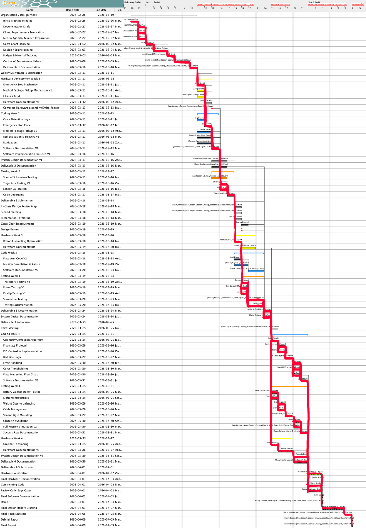  

*Figure 2. Gantt chart for design and implementation of the medicine delivery robot.*

| ID | Requirement Category | Description |
| :---- | :---- | :---- |
| FR1 | Initial Package Acquisition | The system must start at the Pharmacy (Blue Tile) and securely acquire foam cubes from the counter without dragging them across the floor. |
| FR2 | Room & Target Detection | The system must detect patient rooms (Yellow Tiles) and enter through 24 cm wide doorways (marked by Orange lines). |
| FR3 | Logical Medicine Delivery | The system must scan bed indicators and deliver one cube to each Green bed while bypassing all Red beds. |
| FR4 | HRI Auditory Feedback | The system must provide distinct auditory signals for a successful "Package Delivery" and a "Mission Complete" status. |
| FR5 | Navigation & Recovery | The system must autonomously navigate a 1.2 m x 1.2 m grid and return to the Pharmacy after all deliveries are verified. |
| FR6 | Spatial Maneuverability | The robot must maintain a chassis geometry that allows for a full 360° rotation within the confines of a patient room and passage through 24 cm doorways. |
| PR1 | Time Criticality | The entire mission—from initial pickup to final return—must be completed within a maximum of 180 seconds. |
| SR1 | Safety & Emergency Stop | A physical, manual emergency stop must be integrated to immediately terminate all motor torque and software execution. |

*Table 2. Table of function requirements with descriptions* 

| ID | Constraint Category | Description |
| :---- | :---- | :---- |
| DC1 | Hardware Limitation | The design is restricted exclusively to components provided in the DPM Kit (LEGO, BrickPi/Raspberry Pi, motors, and sensors). |
| DC2 | Manufacturing Restriction | All forms of 3D printing or custom-machined parts are strictly prohibited; only approved materials like tape/paper may be used for mounting. |
| DC3 | Port Availability | A maximum of four motors and four sensors can be used, as this is the total number of ports on the BrickPi module. |
| DC4 | Sensor Inventory | A maximum of one (1) of each sensor from among ultrasonic, gyro and color, and of two (2) touch sensors can be used, as these are the quantities provided in the DPM kit. |
| DC5 | Operational Autonomy | The system must function with 0% human intervention once the mission begins; any manual interaction results in immediate failure. |
| DC6 | Environmental Staticity | The design must operate within a fixed 1.2 m x 1.2 m map with static physical walls and standardized colored floor tiles. |
| PC1 | Schedule Constraint | All design, prototyping, and testing phases must be completed within the rigorous 5-week course timeline. |
| PC2 | Labor Budget | The project must be executed within a total budget of ~270 person-hours (6 members × 9 hours/week × 5 weeks). |

*Table 3. Table of system constraints with descriptions* 

A.  "The Six Bricks" Self-Evaluated Skill Levels by Discipline

|                 Field Member | Management | Software | Electrical | Mechanical | GitHub |
| :---- | :---- | :---- | :---- | :---- | :---- |
| Marny | 5  | 4 | 3 | 2 | 2 |
| Sasha | 3 | 4 | 5 | 4 | 2 |
| Jacob | 4 | 5 | 3 | 3 | 4 |
| Ivan | 4 | 5 | 3 | 3 | 2 |
| Zachary | 3 | 4 | 3 | 1 | 3 |
| André | 3 | 4 | 4 | 4 | 3 |

*Table 25. - Table representing the Six BricksTM members’ individual skill levels in each of five chosen fields,*  
B. Team Weekly Availabilities and Calendar for the Final DPM project from March 8th to April 10th

|   Day Name  | Mon. | Tue. | Wed. | Thu.  | Fri.  | Sat.  | Sun.  |
| :---- | ----- | ----- | ----- | ----- | ----- | ----- | ----- |
| **Marny**  | 2 - 4 | 11:35 - 2  5 - 8 | 11:30 - 1 | 11:35 - 2  3:30 - 5 | 12 - 3:30 | 12 - 5 | 12- 5 |
| **Jacob**  | 1:30 - 4 | 11:35 - 2 6 - 8 | 11:30 - 2:30 | 11:35 - 2 4 - 6 | 12:30 - 2  5:30 - 7   | 12 - 5 | 12 - 5 |
| **Ivan**  | 3 - 7 | 11:35 - 2  4 - 7  | 2:30 - 5:30 | 11:35 - 2 2:30 - 4:30 | 3:30 - 7 | 12 - 5 | 12 - 5 |
| **Andre**  | 3 - 6 | 11:35 - 2  3-5  | 11:30 - 1 | 11:35 - 2  3:30 - 7 | 3:30 - 5:30 | 12 - 5 | 12 - 5 |
| **Zach**  | 2 - 4 | 11:35 - 3 6 - 8 | 2:30 - 5 | 11:35 - 2  4 - 7  | 1 - 3  6 - 7 | 12 - 5* | 12 - 5* |
| **Sasha** | 11:30 -1 | 11:35 - 2 5 - 8  | 11:30 - 1 4-7 | 11:35 - 2 5 - 7 | 4 - 7 | 12 - 5* | 12 - 5* |

*Table 17. Individual member schedules and potential weekend availability.*

Schedule of Meetings and Major Conflicts:  
**MARCH**

| 8th *Hardware H0.1* | 9th Math 240 WebWork 3  | 10th *SCHEDULED WEEKLY TEAM MEETING* | 11th Deliverable 1 DUE 9:00 *WEEKLY TA MEETING Chassis Build Ivan Zach Navigation: Zach Jacob Bed Logic:Marny Ivan*  | 12th Ecse 223 Deliverable *Software S0.1.4, S 0.1.5, S0.2.0 Hardware H0.2* | 13th ECSE 210 Quiz  | 14th |
| :---- | :---- | :---- | :---- | :---- | :---- | :---- |
| 15th  | 16th ***Software S0.3.0  Hardware H1.0*** | 17th ***SCHEDULED WEEKLY TEAM MEETING***  **TESTING: Component level  Motors  Colour Sensor(V1 & V2)  Gyro Sensor**  | 18th Deliverable 2 DUE 9:00 ***WEEKLY TA MEETING Software S0.4.0*** | 19th | 20th ECSE 211 Midterm  | 21st  **TESTING:  Subsystem level  Grabber(Cube Management)** |
| 22nd **TESTING: Vision when entering a room, detecting a bed**  | 23rd | 24th ***SCHEDULED  WEEKLY TEAM MEETING Software S1.0.0*** **TESTING: assess reliability of turning, entering first room, locating bed for week 3 dmeo**   | 25th Deliverable 3 DUE 9:00 ***WEEKLY TA MEETING Software S2.0.0, S2.2.0 Hardware H1.1*** | 26th -ECSE 223 Midterm **TESTING: Software Level Color detecting rgb code + color sensor (dual subsystem)** | 27th | 28th |
| 29th | 30th | 31st Deliverable 2 DUE 9:00 ***Software S2.3.0***  |  |  |  |  |

*Table 18.* 

**APRIL**

| 1st Deliverable 4 DUE 9:00 *WEEKLY TA MEETING Hardware H2.0* | 2nd  | 3rd TESTING: Software Level Color detecting hsv code + color sensor (dual subsystem) | 4th *Hardware H2.1* | 5th | 6th | 7th *Hardware H2.2 Massive robot accuracy revamp Jacob, André, Zach, Ivan* |
| :---- | :---- | :---- | :---- | :---- | :---- | :---- |
| 8th ***Final calibration of distances Jacob, André, Zach, Ivan Final report work Sasha, Marny Software S2.4.0*** | 9th ***Last minute testing Jacob, André, Zach Software S3.0.0*** **DEMO** | 10th  Ecse 223 Deliverable  | 11th | 12th | 13th | 14th |
| 15th  | 16th -Finals Start | 17th Exam | 18th Exam | 19th Exam | 20th Exam | 21st Exam |
| 22nd Exam | 23rd Exam | 24th Exam | 25th Exam | 26th Exam | 27th Exam | 28th Exam |
| 29th Exam | 30th -Finals end |  |  |  |  |  |

*Table 19.* 

| Member | Task | Time |
| :---- | :---- | :---- |
| Jacob Sauvé | Meeting Minutes Development of pre-alpha software and hardware Brainstorming system and subsystem designs Deliverable 1 documentation **Total** | 0.5 hours 1 hour 2 hours 5.5 hours **9 hours** |
| Marny Brooker | Completed the lab report (Gantt Chart, system limitations, capabilities, key findings) Budget writing Documenting the report Designing possible ideas to start to implement **Total** | 4 hours 1 hour 1 hour 3 hours **9 hours** |
| Zachary Chuang | Determined requirements, constraints, and specifications Brainstormed ideas for grabber and drive mechanisms Participated in writing meeting minutes **Total** | 2 hours 3 hours 1 hour **6 hours** |
| Ivan Gaspart | Determined requirements, constraints, specifications Helped writing, proofreading, drawing sketches for deliverable 1 Helped draft documentation for future testing and hardware designs Contributed in the initial brainstorm **Total** | 1 hour 4 hours 1 hour 2 hours **8 hours** |
| André Savard | Prototyped cube grabber mechanisms; explored multi-cube options Wrote deliverable documentation regarding time and task allocation Reviewed and revised documentation **Total** | 3 hours 1 hour 1 hour **5 hours** |
| Sasha Gelfand | Contributed to electing overall group structure Brainstorming various sub systems (hardware and software) Sketched potential subsystem designs and established their strengths Documented and developed mechanically different drive system ideas Contributed to deliverable document **Total** | 0.5 hour 2.5 hours 2 hours 2 hours 2 hours **9 hours** |

*Table 20.* 

| Member  | Task Time |  |
| ----- | ----- | :---- |
| Jacob Sauvé | Proofread and completed prior documentation for Deliverable 2 report including software and integration sections. Iteratively developed system software, namely navigation and multiprocessing system architecture overhaul.  Provided conceptual input during hardware prototyping phase **Total** | 4 hours 9 hours 1 hour  **14 hours** |
| Marny Brooker | Completed the lab report by building the second version of the Gantt Chart based on the feedback from week one, Budget writing Preparing presentation for march the 19th  Managed the group on the advancements by using the gantt chart as a model Worked on the room code **Total** | 4.5 hours  2 hours 1 hour 0.5 hours 3 hours **11 hours** |
| Zachary Chuang | Prototyped drive system, including chassis and foundation of our robot.  Worked on navigation code, including a line following script using the color sensor and rotation in place.  Documented testing process with our work session reports.  | 5 hours 4 hours 3 hours  **12 hours** |
| Ivan Gaspart | Added redundancy to every part of the hardware rigs Integration of the wheels, ball bearing, rotator tracks with the BrickPI Helped writing, proofreading, drawing sketches for deliverable 2 Helped draft documentation for future testing and hardware designsBrainstorm and thought process for the path to take and robot behaviour during the hard-coded demo sequence Helped André with robotic arm  | 1 hour 5 hours 4 hours 2 hours 2 hours 2 hours Total: **16 hours** |
| André Savard | Prototyped possible cube grabber mechanisms, and explored options allowing for the grabbing of multiple cubes at once.  With collaboration from team members decided on a final cube grabber design enabling picking up of two medicine blocks simultaneously and independently. Preliminary grabber testing. Helped Zach with chassis design first full hardware subsystem integration, although subject to change. Final integration idea brainstorming and prototyping,  Documentation Expected hours were 15, which leaves 5 hours unaccounted for. This is due to a delay in the design of the software until a grabber mechanism had been successfully prototyped and chosen. Week 3 includes dedicated time for delayed tasks from the intense week 2.  | 2 hours 2 hours 1 hour 2 hours 1 hour 2 hours  **Total: 10 hours** |
| Sasha Gelfand | Assisted in the physical implementation of the emergency stop mechanism. Helped integrate grabber and chassis hardware subsystems. Conducted preliminary trajectory testing and partial sensor calibration to ensure HW reliability of the alpha prototype.  Contributed to deliverable 2 preparation and weekly team coordination meetings.  | **1 hours 2 hours 3 hours 5 hours Total: 10 hours** |

*Table 21.* 

| Member | Task | Time |
| :---- | :---- | :---- |
| Jacob Sauvé | Grabber software for grabbing individual blocks Sweeping mechanism for color sensor Color sensor data classification Emergency stop implementation and debugging Megamind system refinement and code organization Concurrent commands handling Emergency stop, color sensor, classification, and full demo testing System and task allocation documentation **Total** | 1 hour 2 hours 1 hour 2 hours 2 hours 2 hours 2 hours 2 hours **14 hours** |
| Marny Brooker | Gantt Chart Improvements Design Review Hardware Documentation Software Documentation Simulation Testing Deliverable 3 Documentation **Total** | 2 hours 1 hour 1 hour 1 hour 1 hour 3 hours **9 hours** |
| Zachary Chuang | Hardware iteration and final design Documented component and integration tests Documented iterations of final system design **Total** | 2 hours 4 hours 3 hours **9 hours** |
| Ivan Gaspart | Assembling robot and optimizing material usage for hardware Design review preparation and presentation Arm/cube retrieval code and software code documentation Documentation of testing procedures Deliverable 3 documentation **Total** | 1 hour 1 hour 2 hours 2 hours 4 hours **10 hours** |
| André Savard | Emergency stop software implementation Color sensor sweep motor software implementation Color sensor classification implementation Musical confirmation system Debugging: Emergency stop Grabber not properly setting speed Concurrent instructions not functioning Hardware documentation Task and contribution documentation **Total** | 1 hour 1 hour 1 hour 0.5 hours 1 hour 1 hour 1 hour 3 hours 0.5 hours **10 hours** |
| Sasha Gelfand | Documentation of test procedures Documentation of test results Deliverable 3 write up Hardware/Software documentation Design Review prep/presentation **Total** | 3 hours 1.5 hours 2 hours 1 hour 1.5 hours **9.5 hours** |

*Table 22.* 

| Member  | Task Time |  |
| ----- | ----- | :---- |
| Jacob Sauvé | Partially Overseeing Chassis Overhaul - providing software insights (H 2.0) Sensor queue type-safety overhaul, fixing previously inconsistent drift correction (S 2.3.0, safeGet) Debugging, testing and co-developing robot rotation script (S 2.3.0, turning) Integration-testing Composite Robot Workflows (Demo 1 tasks + turning) Documenting Software Progress Reviewing and Polishing Deliverable 4 Documentation **Total** | 0.5 hours 1 hour 3 hours 2 hours 0.5 hours 2 hours **9 hours** |
| Marny Brooker | Navigation Hardware Overhaul (H2.0, chassis) Deliverable 4 Documentation Testing Documentation Hardware Documentation Navigation Test Pickup Test Room Logic Test **Total** | 1 hour 2 hours 2 hours 1 hour 1 hour 1 hour 1 hour **9 hours** |
| Zachary Chuang | Disassembled Ripper I and designed a new grabber mechanism to be more compact and rigid (H 2.0, grabber) Wrote a turning method for the robot (S2.3.0, turning) Debugged and wrote a script to pick up blocks in the pharmacy (S2.3.0, grabber) Wrote system design documentation **Total** | 2 hours 3 hours 2 hours 2 hours **9 hours** |
| Ivan Gaspart | Wrote script for successful delivery sound (S2.3.0, delivery jingle) Rewrote script for color classification (S2.3.0, HSV) Debugged color classification and calibrated constants in script (S2.3.0, HSV) Started debugging sweeper and robot movement (S2.3.0, ISSUES) Deliverable 4 Documentation **Total** | 2 hours 1 hour 2 hours 2 hours 2 hours **9 hours** |
| André Savard | Deliverable 4 Hardware Documentation Debugging - grabber subsystem (H 2.2, S 2.3.0) Preliminary Full Mission Design & Integration Testing (H 2.2, S 2.3.0) Complete hardware subsystem and integration overhaul (H 2.1, 2.2) Color sensor & bed finding subsystem re-integration (H 2.2, S 2.3.0) **Total** | 2.5 hours 1 hour 1 hour 3 hours 1 hour **8.5 hours** |
| Sasha Gelfand | Deliverable 4 documentation Hardware revamp, partial oversight (H2.1, chassis) Testing documentation Navigation testing Hardware documentation **Total** | 2 hours 0.5 hours 4 hours 1 hour 1.5 hours **9 hours** |

*Table 23.* 
Section 2

| Code | Stand for... | Focus Area |
| :---- | :---- | :---- |
| FR | Functional Requirement | What the robot does. |
| PR | Performance Requirement | How fast/accurate it is. |
| SR | Safety Requirement | How it remains safe. |
| DC | Design Constraint | The hardware/parts limits. |
| PC | Project Constraint | The time/labor limits. |

*Table 24. ID Meaning*

Section 3

Section 3.3.2 - Complete Software Version History

### S0.1.0

**Nickname/main feature**: “Slow Your Roll”  
**GH Commit**: [bd7aed1](https://github.com/jacob-sauve/Ripper/commit/bd7aed104932ec91b5624d932546bdecfbb897d7)  
**Reasons for iteration:**

- First version, testing motor control  
  **Description of additions**:   
- Bilateral motor actuation  
- Rolls backwards at a slow, constant speed

**Overall functionality list:**

- Backwards motion  
  - No stopping  
  - No set speed/distance

### S0.1.4

**Nickname/main feature**: “Big Stepper”

  **GH Commit**: [7b140a1](https://github.com/jacob-sauve/Ripper/commit/7b140a1811446c9cf52e732f4e3f2a2322975461)

  **Reasons for iteration:**

- Assessing precision, accuracy and repeatability of controlled rectilinear motion without sensor feedback  
- Persistent inaccuracies, drift, and/or overall lack of motion repeatability will prompt implementation of feedback systems for rectilinear motion  
  **Description of additions**:   
- Ability to move Ripper forward a given distance at a certain speed

**Overall functionality list:**

- Rectilinear motion  
  - Chosen distance (cm)  
  - Chosen speed (dps)  
  - Fixed direction (forward)

### S0.1.5

**Nickname/main feature**: “A PIVOTal step”

  **GH Commit**: [8fbca8c](https://github.com/jacob-sauve/Ripper/commit/8fbca8c4c140e22ab2727c675f117f13e2e2385a)

  **Reasons for iteration:**

- Assessing precision, accuracy and repeatability of controlled rotation without sensor feedback  
- Persistent inaccuracies, drift, and/or overall lack of motion repeatability will prompt implementation of feedback systems for turns  
  **Description of additions**:   
- Ability to move Ripper forward OR BACKWARD a given distance at a certain speed  
- Ability to rotate Ripper a given number of degrees at a certain speed  
  **Overall functionality list:**  
- Rectilinear motion  
  - Chosen distance (cm)  
  - Chosen speed (dps)  
  - Chosen direction (forwards/backwards)  
- Rotation  
  - Chosen angle (degrees, algebraic)  
  - Chosen speed (dps)

### S0.2.0

**Nickname/main feature**: “Choo Choo”

  **GH Commit**: [786cad9](https://github.com/jacob-sauve/Ripper/commit/786cad996551d9b8fa80a85ccb218238946d2d26)

  **Reasons for iteration:**

- Overall lack of precision and repeatability of feedback-free locomotion:  
  - Persistent drift during rectilinear motion due to electronic and chassis drawbacks (sag, power inconsistencies between motors)  
  - Persistent inaccuracies when turning, resulting in cumulative angular drift  
- Testing color sensor rig reliability within the arena to calibrate future use whether for line-following or bed/door detection  
  **Description of additions**:   
- Ripper can perform line-following when desired  
- Ripper can perform hard-coded locomotion and rotation  
- Ripper can go forward until a door, double back, and repeat  
  **Overall functionality list:**  
- Rectilinear motion  
  - Chosen speed (dps)  
  - Chosen direction (forwards/backwards)  
  - Two modes:  
    - Chosen distance, no feedback (cm)  
    - Line-following (undetermined distance)  
- Rotation  
  - Chosen angle (degrees, algebraic)  
  - Chosen speed (dps)

  

### S0.3.0

**Nickname/main feature**: “Big Brains”

  **GH Commit**: [2af3437](https://github.com/jacob-sauve/Ripper/commit/2af343789e6ec597e03f8ecd22379ebc256e38b7)

  **Reasons for iteration:**

- Significant drift despite line-following  
- Inconsistencies in line-following upon reaching junctions in the hospital grid  
  - Ripper will veer off course and never find the line  
- Turns remain inconsistent  
  - Inaccurate  
  - Cumulative angular drift

  **Description of additions**: 

- Implementation of the beginnings of a multiprocessing framework to port over existing functionality and allow for expanded functionality, i.e. real-time sensor feedback during locomotion  
- Ripper’s motion is now split into 3 processes using the [multiprocess](https://multiprocess.readthedocs.io/en/latest/multiprocess.html) library:  
  - Dispatcher (class ***Megamind***) → reads and sends instructions  
    - Can receive instructions to its queue which it uses to update actuator wrapper objects’ respective queues  
    - Pickle-safe instructions are in the form:  
      - tuple(command_name: str, \*args: any)  
      - Command_name is mapped to an actual function at runtime by Megamind using Megamind.func_dict  
  - class ***Driver*** controls motor actuation  
    - Instance 1: Right Wheel  
    - Instance 2: Left Wheel  
- No sensor or turning implementation yet within the framework  
  **Overall functionality list:**  
- Queueing series of instructions for Ripper to perform sequentially (FIFO)  
  - Multiprocessing framework with multiprocess.Queue objects  
  - Pickle-safe instructions are loaded and subsequently translated by Megamind into function calls  
- Rectilinear motion  
  - Chosen speed (dps)  
  - Chosen direction (forwards/backwards)  
  - Chosen distance, no feedback (cm)

### S0.4.0

**Nickname/main feature**: “Need for Feed(back)”

  **GH Commit**: [95df432](https://github.com/jacob-sauve/Ripper/commit/95df4328fbbfcd0b500d809505b157fde23bc0ce)

  **Reasons for iteration:**

- Multiprocessing having been demonstrated as functional in replicating prior functionality, the shift could be made to implementing new functionalities which prompted the transfer in the first place; i.e., feedback  
  **Description of additions**:   
- Integration of Sensors into the multiprocessing model with wrapper class ***Vision***  
  - Instance 1: Gyro Sensor  
- Megamind dispatcher now…  
  - polls sensor status from a sensor’s Vision.queue   
  - controls motors through queued instructions to Driver.queue based on thus-obtained real-time data  
- Successful drift control on rectilinear trajectories using Gyro feedback  
  **Overall functionality list:**  
- Queueing series of instructions for Ripper to perform sequentially (FIFO)  
- Rectilinear motion  
  - Chosen speed (dps)  
  - Chosen direction (forwards/backwards)  
  - Chosen distance (cm)  
  - Drift mitigation using real-time gyro sensor feedback

  

### S1.0.0

**Nickname/main feature**: “Megamind I - Multitasker”

  **GH Commit**: [ff9a265](https://github.com/jacob-sauve/Ripper/commit/ff9a265f89b33ac8467152f2dad6bdcdf7f8ae7d)

  **Reasons for iteration:**

- H1.0 hardware iteration implemented the Grabber subsystem which thus required software to control its operation  
- Preliminary grabber testing revealed fundamental operational flaws which were necessary to address, including:  
  - Inability to stop Grabber motor operation short of running brick.reset_brick()  
  - Indelible, continuous, progressive acceleration of motor rotation regardless of initial speed set using Motor.set_dps()  
  - ⇒ Overall unusable Grabber  
- Unexplained inability to chain tasks in Megamind.queue due to blocking function call of unknown origin after first instruction (regardless of nature)  
- Lack of software support for emergency stop feature within new multiprocessing framework  
  **Description of additions**:   
- All motors (Driver wrapper class) ported from speed control to power control  
  - Grabber (NXT) maintains constant speed (no more continual increase)  
  - Grabber can be stopped using   
- All Drivers respond to self._stop() command instantly  
  - No longer need for time-based kill  
- Megamind.killAll() added to main branch upon emergency stop trigger:  
  - always works  
  - is instantaneously effective to the human eye (i.e. <0.1s latency)  
- Megamind.clearSensorQueues() fixed to remove blocking after first instruction  
  - Multiple tasks can be chained and successively executed successfully

  **Overall functionality list:**

- Queueing series of instructions for Ripper to perform sequentially  
  - Sequence of instruction can be executed in succession (FIFO)  
  - Processes can be terminated at any time with Megamind.killAll()  
- Rectilinear motion  
- Rudimentary grabbing  
  - Chosen speed (dps)  
  - Chosen “distance” travelled by hypothetical block being pulled upwards (cm)

  

### S2.0.0

**Nickname/main feature**: “Megamind II - Walk ‘n Talk”

  **GH Commit**: [3848c65](https://github.com/jacob-sauve/Ripper/commit/3848c656399684a531d07cfd29fbf49843103137)

  **Reasons for iteration:**

- Drift-corrected rectilinear motion works well over long distances, but fails on short distances, especially on successive, short-distance calls  
  - Microdrifts uncorrected by end of rectilinear movement accumulate, resulting in non-negligible long-term angular drift as current orientation is taken as baseline “0 degrees” in new motion  
- Integration of sweeper arm and color sensor (H1.1) into software system  
- Need for musical output for demo 1  
  **Description of additions**:   
- Drift correction based on initial orientation, no longer orientation at time of function call  
  - Removes compounding of leftover non-corrected micro-drifts over multiple iterations, leading to macro-drifting despite correction  
  - Renders use in micro-movements possible, i.e. for Megamind._sweep() which successfully finds a bed in a single-person room and plays a chime  
- Music functions added using utils.sound  
- Sweeper arm back and forth rotation, approximately 180 degrees range of motion (ROM), with continuous parallel color sensor polling  
- Color classification algorithm using trigonometric, one-dimensional “omega” value associated to a given RGB trio  
  - Detects orange (doors) ~80% accuracy  
  - Detects green-on-yellow (translucent beds in rooms) ~70% accuracy  
- Successful (in order and in one Megamind function call):  
  - forward locomotion w/drift correction (50cm)  
  - grabber activation (loadless motor rotation, no block pickup as of yet)  
  - forward sweep/motion loop  
  - jingle when sweep hits green bed, immediately, i.e. with correct angle detection

  **Overall functionality list:**

- Queueing series of instructions for Ripper to perform sequentially  
- Rectilinear motion  
  - Absolute drift mitigation using real-time gyro sensor feedback  
  - Two modes  
    - _go_to_door(speed)  
      - Move forward/backward until a door (color orange) is detected by the color sensor  
    - _go_with_sensors(distance, speed)  
      - Move forward/backward a chosen distance (cm)  
- Rudimentary grabbing  
- Color classification using front-mounted sweeper  
  - Orange (~80% accuracy)  
  - Green-on-yellow (~70% accuracy)

### S2.2.0

**Nickname/main feature**: “Megamind III - Demo 1 Version”  
**GH Commit**: [98901b0](https://github.com/jacob-sauve/Ripper/commit/98901b08da52d4113a12a3a3c123ec3b211947e8)  
**Reasons for iteration:**

- Fine-tuning all functionalities before demo 1, namely  
  - Inaccurate bed detection (~70% green-on-yellow detection during sweeps)  
  - Adding red bed detection  
  - Rectilinear motion  
    - Drift correction coefficient DRIFT_CORRECTION needs tuning, correction is too slow

  **Description of additions**: 

- Full demo 1 functionality, i.e.:  
  - _go_to_door() drift-corrected motion until room entrance  
  - _sweep() forward motion with periodic motorised sweeping of color sensor while polling  
  - Upon detection of…  
    - Red bed: exits room using _go_to_door() with negative speed  
    - Green bed: plays a chime  
- ISSUES:  
  - Drifts into wall  
    - Typically when it hits a junction (lots of black → discarded readings → get causes stalling…?)  
  - False positive on yellow & yellow/white border  
    - Refine color classification by including ranges  
  - Sound delay  
    - com

  **Overall functionality list:**

- ***Megamind***.queue.put((“COMMAND”, \*args))  
  - Adds command Megamind.funcdict.get(“COMMAND”) with arguments \*args to the main execution queue  
  - Supported commands are:  
    - _go_to_door(speed)  
      - Move forward/backward at speed dps until a door (color orange) is detected by the color sensor  
      - Drift-corrected in real time (gyro)  
    - _go_with_sensors(distance, speed)  
      - Move forward/backward a chosen distance (cm) at speed dps  
      - Drift-corrected in real time (gyro)  
    - _grab(distance, speed)  
      - Activates grabber at speed dps to rotate conveyor belt by distance cm  
    - _sweep(range_of_motion, centered, speed)  
      - Iteratively perform a sweep of breadth range_of_motion, starting at position  
        - current_angle - (range_of_motion//2) if centered == True  
        - current_angle if centered == False  
      - Between every two sweeps (back and forth), advance by FW_PER_SWEEP centimetres at speed dps.  
      - Poll colour sensor continuously to detect:  
        - Red bed: exits room using _go_to_door() with negative speed  
        - Green bed: plays a sound using victor_jingle()  
    - victor_jingle()  
      - Plays Shibuya station (Tokyo) metro jingle, as transcribed by Ivan and André, using utils.sound  
    - clearSensorQueues()  
      - Clears all Vision.queue objects (instances of multiprocess.Queue)  
      - Returns most recent reading, i.e. last element of cleared queue (FIFO principle)  
- ***Vision***.queue.get()  
  - Returns dictionary of most recent sensor data read by the sensor wrapped by given Vision object  
  - Supported sensors are:  
    - Color  
    - Gyro  
    - Touch  
- ***Driver***.queue.put((“COMMAND”, \*args))  
  - Adds command Driver.funcdict.get(“COMMAND”) with arguments \*args to the main execution queue  
  - Supported commands are:  
    - _go(speed)  
      - Uses Motor.set_power(power) to set EV3 Servomotor’s power to a level corresponding to the desired speed  
    - _stop()  
      - Sets Motor power to 0 to halt rotation

### S2.3.0

**Nickname/main feature**: “Megamind IV - To Infinity and Beyond”

  **GH Commit**: [2d92206](https://github.com/jacob-sauve/Ripper/commit/2d922067556e88721cb56a593472293c28d1c593)

  **Reasons for iteration:**

- Major failures during demo 1:  
  - Megamind._go_to_door()  
    - Whenever a junction on the grid was hit and color-detected, robot would suddenly veer left and crash into the wall  
    - Suspicion: color reading which checks for door uses color.queue.get(), which is a blocking get call that waits for a non-empty queue to return. The extra black ink at junctions may cause a null reading, resulting in a blocking queue.get() call and thus a stop in motor actuation since Megamind cannot queue subsequent instructions until the get is resolved.  
      - Could be replaced with color.queue.get(False) which is non-blocking, but this throws an Empty Exception if the queue is empty  
  - Megamind._sweep()  
    - Color classification algorithm was wildly inaccurate for all colors, i.e. orange, red and green (66% failure over 3 demo trials with the TA)

  **Description of additions**: 

- safeGet(queue, wait), a method dynamically assigned to Queue objects at runtime which wraps queue.get calls with a queue.empty check to prevent errors. Uses a blocking call if wait == True.  
  - ⇒ fixes drift script loop by removing stalling upon hitting junctions  
- Color classification algorithm complete revamp: going from 1D classification to 3D H(ue), S(aturation), [Brightness] V(alue) classification or HSV.  
  - ⇒ S and V parameters allow highly accurate removal of ‘background color’ (grey, white, black) false positives in testing trials  
  - ⇒ removed majority of false positives in testing trials  
- Turning algorithm using the gyro sensor  
- Beginnings of grabber function integration  
- New (yet untested) delivery jingle in addition to victor jingle  
- ISSUES  
  - Sweeping of color sensor is done over incomplete range of motion and often with significant drift  
    - ⇒ fix linear drift “memory”  
  - Turns still inaccurate  
    - ⇒ fix turn drift “memory”

  **Overall functionality list:**

- ***Megamind***.queue.put((“COMMAND”, \*args))  
  - Adds command Megamind.funcdict.get(“COMMAND”) with arguments \*args to the main execution queue  
  - Supported commands are:  
    - _go_to_door(speed)  
      - Non-blocking Empty-safe color.queue.safeGet(False)  
    - _go_with_sensors(distance, speed)  
    - _grab(distance, speed)  
    - _sweep(range_of_motion, centered, speed)  
    - victor_jingle()  
    - delivery_jingle()  
      - Ivan-retranscribed Wii Sport victory sound, compiled using utils.sound  
    - clearSensorQueues()  
- ***Vision***.queue.get()  
  - Returns dictionary of most recent sensor data read by the sensor wrapped by given Vision object  
  - Supported sensors are:  
    - Color  
    - Gyro  
    - Touch  
- ***Driver***.queue.put((“COMMAND”, \*args))  
  - Adds command Driver.funcdict.get(“COMMAND”) with arguments \*args to the main execution queue  
  - Supported commands are:  
    - _go(speed)  
      - Uses Motor.set_power(power) to set EV3 Servomotor’s power to a level corresponding to the desired speed  
    - _stop()  
      - Sets Motor power to 0% to halt rotation

### S2.4.0

**Nickname/main feature**: “Megamind V - Optimus”

  **GH Commit**: [ab8f62b](https://github.com/jacob-sauve/Ripper/commit/ab8f62b9733fcc6dc81699d9ff010996812d0977)

  **Reasons for iteration**:

- _go_to_door()  
  - If bed or door somehow missed, then robot continues straight indefinitely and hits the wall, costing points and structural integrity  
- _grab()  
  - Requires forward motion to best “scoop” a block  
  - Would be ideal if this could occur at least partially *during* the grab instead of merely beforehand  
- Writing commands to main.py in the form brain.queue.put_nowait(("COMMAND", \*args)) is tedious, hard to read, and leads to potentially codebase-compromising issues and merge conflicts if file is accidentally otherwise altered during instruction change  
- Music compilation consistently adds 5-10 seconds to initialisation time, even though the same sounds are used for every run  
- New sweeper height (H2.2) requires HSV color classification threshold recalibration, as door and bed detection accuracy dropped significantly with both false positives and false negatives representing ~50% of test run-throughs  
  **Description of additions**:  
- _go_to_door()  
  - Max room depth & room distance, respectively set to 40 and 80cm  
  - Ripper no longer mashes into walls at full speed during unsuccessful _go_to_door() or _sweep()!  
- Added _grab_and_go()  
  - Grab and move forward for optimal block absorption  
- Command_parser.py  
  - commands.txt → list(tuple(command_name: str, \*args: any)) → Megamind.queue  
  - Changing instructions is now as easy as editing a plaintext file!  
  - Also safer  
    - Invalid commands/args are filtered before runtime  
    - Hence, indirectly supports commenting & whitespace (ignored/filtered)!  
- Music  
  - Sounds compiled before runtime and only if not already existent  
- HSV threshold adjustment after H2.2 sweeper stability increase and height adjustment  
  - Back to >95% color detection accuracy for doors and beds

  **Overall functionality list:**

- ***command_parser.py*** parses commands.txt  
  - Parses commands.txt into format list(tuple(command_name: str, \*args: any))  
  - Returns produced list  
- ***main.py*** puts parsed commands to Megamind.queue  
  - Receives commands parsed by command_parser.py  
  - Puts each resulting command tuple to Megamind instance “brain” ’s queue  
- ***Megamind***.queue.put((“COMMAND”, \*args))  
  - Adds command Megamind.funcdict.get(“COMMAND”) with arguments \*args to the main execution queue  
  - Supported commands are:  
    - _go_to_door(speed)  
      - Maximum room distance of 80cm enforced to prevent wall-mashing  
    - _go_with_sensors(distance, speed)  
    - _grab(distance, speed)  
    - _grab_and_go(distance, speed)  
      - Same functionality as _grab() but with rectilinear motion to enhance scooping of block  
    - _sweep(range_of_motion, centered, speed)  
      - Maximum room depth of 40cm enforced to prevent wall-mashing  
      - Thresholds compatible with H2.2 sweeper height  
    - victor_jingle()  
      - Only compiled if songs.pickle file does not yet exist  
    - delivery_jingle()  
      - Only compiled if songs.pickle file does not yet exist  
    - clearSensorQueues()  
- ***Vision***.queue.get()  
  - Returns dictionary of most recent sensor data read by the sensor wrapped by given Vision object  
  - Supported sensors are:  
    - Color  
    - Gyro  
    - Touch  
- ***Driver***.queue.put((“COMMAND”, \*args))  
  - Adds command Driver.funcdict.get(“COMMAND”) with arguments \*args to the main execution queue  
  - Supported commands are:  
    - _go(speed)  
    - _stop()

### S3.0.0 [final version]

**Nickname/main feature**: “Megamind VI - Ultimatum”

  **GH Commit**: [85cabcb](https://github.com/jacob-sauve/Ripper/commit/85cabcb475a3526f1641ad46553cdd8945eef966)

  **Reasons for iteration**:

- Inaccurate block-to-bed dropping could potentially cost us 2 (no good drops, no bad drops) to 4 (no good drops, 2 bad drops) points out of 10 in the final demo, and is thus a top priority issue  
- Final instructions tuning for final demo in commands.txt, i.e. distances, angles, speeds…  
  **Description of additions**:  
- _sweep()  
  - Remove sweeper range of motion parameter (point of failure)  
  - Reorder sleep, color reading and rotation  
    - Increase sweeper snappiness to levels nearing original  
  - Trigonometric block dropping in _sweep() function  
    - jump from ~25% bed drop accuracy to ~100% bed drop accuracy (never failed in test trials after 1st calibration)

Tuned commands.txt instructions for optimal 10/10 run at near-full battery capacity  
**Overall functionality list:**

- ***command_parser.py*** parses commands.txt  
- ***main.py*** puts parsed commands to Megamind.queue  
- ***Megamind***.queue.put((“COMMAND”, \*args))  
  - Adds command Megamind.funcdict.get(“COMMAND”) with arguments \*args to the main execution queue  
  - Supported commands are:  
    - _go_to_door(speed)  
    - _go_with_sensors(distance, speed)  
    - _grab(distance, speed)  
    - _grab_and_go(distance, speed)  
    - _sweep(speed)  
      - Trigonometric block dropping determines exact angle and orientation of bed based on sweeper motor encoder data  
    - victor_jingle()  
    - delivery_jingle()  
    - clearSensorQueues()  
- ***Vision***.queue.get()  
  - Returns dictionary of most recent sensor data read by the sensor wrapped by given Vision object  
  - Supported sensors are:  
    - Color  
    - Gyro  
    - Touch  
- ***Driver***.queue.put((“COMMAND”, \*args))  
  - Adds command Driver.funcdict.get(“COMMAND”) with arguments \*args to the main execution queue  
  - Supported commands are:  
    - _go(speed)  
    - _stop()

  

  **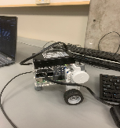**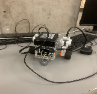

  *Figure 9. Initial prototype, with only locomotion functionality.*

  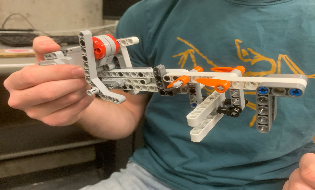

  *Figure 10. First grabber prototype. Deemed to be too bulky and resource heavy.*

  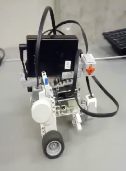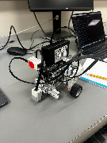

  *Figure 11. First integration of color sensor vision subsystem with the navigation subsystem.*

  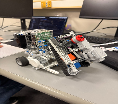

  *Figure 12. First integration of the grabber subsystem with the vision and drive subsystems.*

  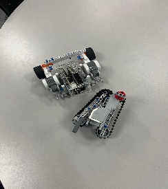

  *Figure 14. Disassembly and rebuild of the drive and grabber subsystems.*

|    # pharmacy logic    angle_sweeper 90    go 22 350    grab_n_go 4 500    grab 2 -500    go 12 -350    turn 30 300    go 4 350    grab_n_go 2 500 grab 4 500 go 13 -350 turn -30 400 go 10 -350 turn -90 370 # room 1 angle_sweeper 0 go_door sweep go 4 -350 # room 2 turn 90 240 angle_sweeper 90 go 47 350 turn -90 400 angle_sweeper 0 Go_door Sweep angle_sweeper 90 go 8 350 turn 87 240 go 28 350 # big room loop turn 90 300 angle_sweeper 0 Sweep go 5 -350 turn -90 400 angle_sweeper -90 go 8 350 turn 45 290 go 8 350 turn 35 240 angle_sweeper 0 Sweep # go back home go 10 350 angle_sweeper 90 turn 88 200 go 77 350 turn -92 400 angle_sweeper 0 Go_door angle_sweeper 90 go 27 350 final_jingle |
| :---- |

*Table 23. Full commands.txt file used during the ultimate run of the final system demonstration.* 

| Date: | Mar 17, 2026 12:30 PM EDT |
| :---- | ----- |
| **People present/Testers**: | J. Sauvé A. Savard |
| **Author**: | S. Gelfand |
| **Hardware version**: | H 1.0 |
| **Software version**: | S 0.3.0 |
| **Session goal/Purpose of test** [brief]: | This test is to validate the accuracy and repeatability of motor encoder distance values by comparing recorded rotational output to actual physical distance traveled. |
| **Test Objectives** [if applicable - specific, itemized & measurable]: | This test is directed purely at the encoder function of each motor. Our objectives are to verify that the digital distance values produced by each motor's encoder are accurate and repeatable across a range of distances. This includes: - Accurate encoder distance output relative to actual physical distance traveled - Consistent performance across three different target distances (5cm, 10cm, 20cm) - Average error per motor remaining within a 2cm buffer range of the actual recorded distance - Comparative characterization across all four motors (EV3 Large Motor ×3, EV3 Medium Servo Motor ×1) to inform component selection for the drive subsystem Three (3) trials will be run per motor at varying distances. Average error per motor will be calculated and assessed against the 2cm threshold to be considered satisfactory. |
| **Procedure** (numbered steps): | 1. Connect motor with wheel to the BrickPi 2. Mark a 'zero' reference point on the wheel 3. Run rotation for the specified target distance 4. Record actual distance covered by rotation using the reference point 5. Compare with encoded digital distance 6. Calculate and record error 7. Repeat with varying distances (3 total: 5cm, 10cm, 20cm) 8. Repeat with different motors (EV3 Large Motor 1, EV3 Large Motor 2, EV3 Large Motor 3, EV3 Medium Servo Motor) *Note: predicted distance was calculated by multiplying distance per encoder count (wheel circumference ÷ 720 ticks/revolution) by the number of recorded encoder iterations.* |
| **Expected result**: | The expected result is that each motor reliably produces encoded distance values within an acceptable margin of error across all tested distances. This entails consistent digital output regardless of rotation magnitude, with all average errors falling within the specified 2cm buffer zone.  All four motors are expected to meet the accuracy threshold. Results should confirm the suitability of encoded motor values for accurate map traversal, and comparative results between the EV3 Large Motors (95658) and EV3 Medium Servo Motor (45503) will inform drive subsystem component selection. |
| **Format of Output Required**: | EV3 Large Motor 1 (95658) – digital distance and error per trial, average error (cm) EV3 Large Motor 2 (95658) – digital distance and error per trial, average error (cm) EV3 Large Motor 3 (95658) – digital distance and error per trial, average error (cm) EV3 Medium Servo Motor (45503) – digital distance and error per trial, average error (cm)  |
| **Report/Outcomes**: |  Motor — Trial 1 (5cm) / Trial 2 (10cm) / Trial 3 (20cm) — Avg. Error: EV3 Large Motor 1 (95658): 4.9cm (0.1cm err) / 10.2cm (0.2cm err) / 21.1cm (1.1cm err) — **0.47cm** EV3 Large Motor 2 (95658): 5.0cm (0.0cm err) / 9.9cm (0.1cm err) / 21.5cm (1.5cm err) — **0.53cm** EV3 Large Motor 3 (95658): 4.8cm (0.2cm err) / 11.1cm (1.1cm err) / 21.7cm (1.7cm err) — **1.00cm** EV3 Medium Servo Motor (45503): 5.1cm (0.1cm err) / 11.2cm (1.2cm err) / 22.2cm (2.2cm err) — **1.17cm** ⇒ Overall: all four motors recorded average errors **within the 2cm threshold** ⇒ test **passed**. |
| **Conclusions** (for test- Pass/Fail? Specific quantities): | All four motors **successfully passed** the 2cm average error threshold. EV3 Large Motor 1 recorded the lowest average error at **0.47cm**, followed by EV3 Large Motor 2 at **0.53cm**, EV3 Large Motor 3 at **1.00cm**, and the EV3 Medium Servo Motor at **1.17cm** — all well within the acceptable range.  These results confirmed consistent and accurate encoder performance across all motors. The comparative error values additionally provided useful insight for component selection, with EV3 Large Motors 1 and 2 showing the strongest accuracy and therefore being better suited for use in the drive subsystem where lower average error is most beneficial. |
| **Subsequent actions to be taken**: | These findings will be used to inform drive subsystem component selection, prioritizing the EV3 Large Motors (95658) with lower average error values for tasks requiring precise map traversal. Encoder-based distance values from all motors are confirmed reliable for use in practice. |
| **Who is this for** (which leads/managers): | Project Manager Drive Subteam Lead |

*Table 9*

| Date: | Mar 17, 2026 12:30 PM EDT |
| :---- | :---- |
| **People present/Testers**: | J. Sauvé A. Savard |
| **Author**: | M. Brooker |
| **Hardware version**: | H 1.0 |
| **Software version**: | S 0.3.0 |
| **Session goal/Purpose of test** [brief]: | This test is to ensure the fundamental accuracy and functionality of the gyroscopic sensor component and its digital output values. |
| **Test Objectives** [if applicable - specific, itemized & measurable]: | This test is directed purely at the function of the gyroscopic sensor subsystem. Our objectives are to verify that the sensor can accurately record angular rotation and return reliable digital values across a range of rotation amounts and directions. This includes: - Accurate digital value output relative to actual rotation angle - Consistent performance across different rotation magnitudes (three distinct trials) - No significant directional bias between clockwise and counter-clockwise rotation - Average error remaining within a two-degree buffer zone of the actual angle of rotation Three (3) trials will be implemented, each at a different rotation amount, performed in both clockwise and counter-clockwise directions. Each of the above 4 objectives will be assessed, with overall results quantified as an average error value. This average error should not exceed a two-degree threshold to be considered satisfactory. |
| **Procedure** (numbered steps): | 1. Sensor placed at a fixed starting position 2. Sensor physically rotated to a specified target angle 3. Trial performed clockwise 4. Trial repeated counter-clockwise 5. Digital output values and recorded angular distance evaluated post-rotation 6. Above steps repeated for three different rotation magnitudes 7. Average error calculated across all trials and directions 8. Error assessed against two-degree buffer threshold *Note: no complex calculations were required for this test; digital values are processed in degrees relative to the sensor's boot-up position.* |
| **Expected result**: | The expected result is a sensor that reliably reports angular position within an acceptable margin of error across all tested rotation amounts and both directions. This entails consistent digital value output regardless of rotation magnitude or direction, with no meaningful directional bias between clockwise and counter-clockwise rotation. This should correspond to an average error of no greater than two degrees across all trials, confirming the sensor's suitability for accurate navigational use in the robot's traversal system. |
| **Format of Output Required**: | Clockwise rotation accuracy – average error (degrees) Counter-clockwise rotation accuracy – average error (degrees) Overall average error across all trials – pass/fail relative to two-degree threshold Directional bias assessment (qualitative: noticeable difference between CW and CCW)  |
| **Report/Outcomes**: | Clockwise rotation – average error of **2.45°**; exceeded the two-degree threshold, consistent over-estimation observed Counter-clockwise rotation – average error of **3.27°**; exceeded the two-degree threshold, consistent under-estimation observed Overall average error – **2.86°** across both directions ⇒ above the two-degree acceptable threshold Directional bias – noticeable and consistent: over-shoot clockwise, under-shoot counter-clockwise ⇒ Overall: raw sensor accuracy did **not** meet the two-degree target; correction measure required. |
| **Conclusions** (for test- Pass/Fail? Specific quantities): | Raw sensor output **failed** to meet the two-degree error threshold, recording an average error of **2.45° clockwise** and **3.27° counter-clockwise**. The gyroscopic sensor demonstrated a systematic directional bias – over-estimating rotation when turning clockwise and under-estimating when turning counter-clockwise. This error, if left uncorrected, would meaningfully affect the robot's ability to accurately traverse the map. In response, an overshoot/undershoot correction measure was incorporated into the turning process. This measure alternated between overshooting and undershooting to compensate for the average error distance in the digital values. Following this correction, the sensor was able to produce accurate and repeatable turns to selected degree targets, effectively resolving the identified flaw. |
| **Subsequent actions to be taken**: | Ongoing for the development of a successful robot we need to utilize some sort of counter rotation measure that can bring us the proper physical orientation. This is vital to the overall mission success as having the proper location is required for almost every aspect.  |
| **Who is this for** (which leads/managers): | Project Manager Drive Subteam Lead Vision Subteam Lead |

*Table 10*

| Date: | Mar 17, 2026 12:30 PM EDT |
| :---- | :---- |
| **People present/Testers**: | J. Sauvé A. Savard |
| **Author**: | M. Brooker |
| **Hardware version**: | H 1.0 |
| **Software version**: | S 0.3.0 |
| **Session goal/Purpose of test** [brief]: | This test is to determine the hardware reliability and latency of the touch sensors. |
| **Test Objectives** [if applicable - specific, itemized & measurable]: | This test is directed purely at the function of the touch sensor subsystem. Our objectives are to qualitatively determine the reliability of the touch sensors and their latency, both mechanical and for the signal to reach the software. This includes: - Consistent detection of all inputs without dropping any registered clicks - Negligible latency between physical actuation and mapped software output, indistinguishable by typical human perception - Assessment of mechanical factors affecting reliability, such as actuation force and reset time - Comparative characterization of both sensors to confirm uniform performance across all user-input interfaces Two sub-tests will be implemented: a click reliability test (10 and 25 inputs per sensor) and a speaker latency test (repeated trials per sensor). Each of the above 4 objectives will be assessed. The click test will be evaluated on a perfect input-to-registration match, and latency should be negligible for the signal itself to be considered satisfactory. |
| **Procedure** (numbered steps): | **1 Touch Sensor Click Test** a) Securely connect one of the two touch sensors to port S1 of the BrickPi using an RJ45 cable b) Power the BrickPi with a fully charged 12V lithium-ion battery for the duration of the procedure c) Run *touch_and_speaker_test.py* and select reliability testing mode ("r") d) Actuate the sensor manually with normal pressure and observe any visible latency; verify that the number of inputs matches the number of clicks registered in the program output e) Repeat steps a) to d) for the second touch sensor f) Compare results  **2 Touch Sensor Speaker Test** a) Repeat steps a) and b) above b) Connect the speaker to the BrickPi's audio jack output c) Run *touch_and_speaker_test.py* and select speaker sound testing mode ("s") d) One team member actuates the touch sensor while another simultaneously starts a stopwatch; stop the stopwatch when the output sound is emitted and tabulate the latency e) Repeat steps a) to d) for the second touch sensor f) Compare results |
| **Expected result**: | The expected result is that when the sensor is activated, the BrickPi processes the signal with negligible delay resulting in a correctly registered input or outputted sound. For the click reliability test, we expect a perfect match between the number of user inputs and the number of registered clicks for both sensors. For the speaker latency test, any delay introduced by the full pipeline should be negligible in its effect on the output.  Both sensors are expected to exhibit nearly identical behavioral characteristics with no reliability problems and minimal difference in latency, confirming uniform performance across all user-input interfaces. |
| **Format of Output Required**: | Click reliability – Sensor 1, 10 inputs – pass % Click reliability – Sensor 1, 25 inputs – pass % Click reliability – Sensor 2, 10 inputs – pass % Click reliability – Sensor 2, 25 inputs – pass % Speaker latency – Sensor 1, trial 1 – latency (ms) Speaker latency – Sensor 1, trial 2 – latency (ms) Speaker latency – Sensor 2, trial 1 – latency (ms) Speaker latency – Sensor 2, trial 2 – latency (ms)  |
| **Report/Outcomes**: | Click reliability – both sensors registered a perfect match across all trials (10/10 and 25/25 inputs); no dropped inputs observed for either sensor Click latency – negligible for all trials; signal detection was near-instantaneous for both sensors Speaker latency – average of **790ms** across all four trials (756ms, 824ms, 783ms, 736ms); exceeded negligible threshold Comparative performance – both sensors showed near-identical behavior with no meaningful variance in reliability or latency ⇒ Overall: touch sensors **passed** all reliability objectives. Speaker latency is attributable to speaker hardware, not the sensor or software subsystem. |
| **Conclusions** (for test- Pass/Fail? Specific quantities): | Both touch sensors **successfully passed** all reliability objectives. Each sensor registered a perfect input-to-click match across both the 10-press and 25-press trials, with no dropped inputs and negligible signal latency in all click tests. The sensors performed identically with no meaningful variance between the two units, confirming uniform performance across all user-input interfaces.  The speaker latency test revealed an average delay of approximately **790ms** across all four trials. This delay was determined to be a limitation of the speaker hardware itself rather than the touch sensor or software pipeline, as the sensor signal was confirmed to reach the BrickPi near-instantaneously. Unfortunately, this cannot be resolved through software or sensor-level changes given the hardware constraints of the speaker. |
| **Subsequent actions to be taken**: | The touch sensors are confirmed suitable for integration into the full system. The speaker latency of ~790ms should be accounted for in any timing-sensitive audio feedback design decisions, as no hardware-level fix is available. No further action is required on the sensor subsystem itself.  |
| **Who is this for** (which leads/managers): | Project Manager |

*Table 11*

| Date: | Mar 26, 2026 12:30 p.m. EDT |
| :---- | :---- |
| **People present/Testers**: | J. Sauvé Z. Chuang I. Gaspart |
| **Author**: | I. Gaspart |
| **Hardware version**: | H 1.1 |
| **Software version**: | S 2.2.0 |
| **Session goal/Purpose of test** [brief]: | This test is to evaluate the accuracy and reliability of RGB-based colour detection code joined with the colour sensor. |
| **Test Objectives** [if applicable - specific, itemized & measurable]: | This test is directed at the accuracy and reliability of the colour subsystem using raw RGB thresholding to detect colours from the set {red, orange, blue, yellow, green}. The objectives are the following: - Close to perfect accuracy (99.9%) for colour detection across all five target colours - Verification that RGB interval boundaries correctly classify each colour without meaningful misclassification - Confirmation that the detection correctly rejects non-target surfaces, specifically white and black Continuous sampling will be used during a time period of 10s per colour to assess consistency and reliability.  |
| **Procedure** (numbered steps): | 1. Sensor placed over a target colour X 2. Colour detecting code placed in debugging mode (i.e. R, G, B channel values and detected colour printed to terminal) 3. If no colour is detected or detection oscillates, adjust the RGB interval boundaries for colour X accordingly 4. If the colour detected is incorrect, refine the RGB thresholds until correct classification is achieved 5. Repeat step 2 three times until colour X is correctly detected approximately 100% of the time 6. Repeat for all five colours (red, orange, blue, yellow, green) 7. Place sensor over a white surface and observe output; repeat for black surface |
| **Expected result**: | The expected result is a colour subsystem that reliably identifies the correct colour from the set {red, orange, blue, yellow, green} with no misclassification across continuous 10-second sampling periods, and that correctly rejects white and black surfaces as unclassified. |
| **Format of Output Required**: | Per-colour detection accuracy – percentage of samples correctly classified over a 10-second window Final RGB intervals determined for each colour White/black rejection result – pass/fail Overall pass/fail relative to the 99.9% accuracy threshold for each colour |
| **Report/Outcomes**: | Red, blue, and green were each detected correctly ~100% of the time following minor RGB interval adjustments; no misclassification observed between these colours Yellow and orange required significant interval tuning due to their proximity in RGB space; occasional oscillation between the two was observed but was resolved after several iterations White surface testing revealed critical failure: the sensor intermittently misclassified white as yellow or orange, as high RGB values across all three channels fell within the defined colour intervals Black surface testing revealed a secondary failure: low RGB values across all channels were intermittently misclassified as dark variants of red or green depending on ambient lighting conditions The RGB thresholding approach proved insufficiently robust to ambient lighting variation, causing interval drift across sessions |
| **Conclusions** (for test- Pass/Fail? Specific quantities): | The RGB-based colour detection subsystem failed to meet the test objectives. While detection accuracy for the five target colours was acceptable in isolation, the system critically failed to reject white and black surfaces, intermittently misclassifying them as valid target colours. The test is a fail. RGB thresholds were also found to be sensitive to ambient lighting conditions, causing interval boundaries to degrade across sessions. Our choice is to switch to HSV colour space, which finds hue from brightness and saturation, allowing white and black to be rejected independently of colour classification (with brightness and saturation). A follow-up test using HSV-based detection is to be conducted. |
| **Subsequent actions to be taken**: | The touch sensors are confirmed suitable for integration into the full system. The speaker latency of ~790ms should be accounted for in any timing-sensitive audio feedback design decisions, as no hardware-level fix is available. No further action is required on the sensor subsystem itself.  |
| **Who is this for** (which leads/managers): | Project Manager |

*Table 12*

| Date: | Apr 3, 2026 2:15 p.m. EDT |
| :---- | :---- |
| **People present/Testers**: | J. Sauvé I. Gaspart Z. Chuang |
| **Author**: | I. Gaspart |
| **Hardware version**: | H 2.0 |
| **Software version**: | S 2.3.0 |
| **Session goal/Purpose of test** [brief]: | This test is to ensure the accuracy of the new hsv colour detecting code joined with the colour sensor.  |
| **Test Objectives** [if applicable - specific, itemized & measurable]: | This test is for accuracy and reliability of the colour subsystem composed of the colour detecting code and the colour sensor. Accuracy must be close to perfect (99.9%) as the colour subsystem is absolutely crucial for the working of the robot and the demo. The objectives are the following: - Close to perfect accuracy (99.9%) for color detection between red, orange, blue, yellow, and green - Finding correct hue intervals for each colour, verifying theoretical hue values with real testing - Finding saturation and brightness intervals for differentiating a bright colour with white/black Continuous sampling will be used during a time period of 10s for each colour, to ensure that colours are detected correctly, accurately and reliably.  |
| **Procedure** (numbered steps): | 1. Sensor placed over a certain colour X 2. Color detecting code placed in debugging mode (i.e. hue, brightness, saturation and colour detected are printed to the terminal) 3. If no colour is detected or the detection switches periodically, adjust the brightness and saturation lower bounds such that a colour is correctly detected 4. If the colour detected is not colour X, adjust the hue intervals such that colour X is correctly detected 5. Repeat step 2 three times, until colour X is correctly detected approximately 100% of the time 6. Repeat the above three steps for all colours (blue, green, red, yellow, orange) |
| **Expected result**: | The expected result is a colour subsystem that reliably and consistently identifies the correct colour from the set {red, orange, blue, yellow, green} across continuous 10-second sampling periods. This entails stable HSV interval boundaries that correctly classify each colour with no meaningful oscillation between classifications. Detection accuracy should meet or exceed 99.9% for all five colours, with saturation and brightness thresholds sufficient to distinguish vivid colours from white and black surfaces. |
| **Format of Output Required**: | Per-colour detection accuracy – percentage of samples correctly classified over a 10-second window Final HSV intervals (hue, saturation, brightness bounds) determined for each colour Saturation/brightness lower bound thresholds used to differentiate colour from white/black Overall pass/fail relative to the 99.9% accuracy threshold for each colour  |
| **Report/Outcomes**: | **Blue**: detected correctly ~100% of the time after one hue interval adjustment. Readings stabilized around hue 0.437–0.444 (≈157°–160°), saturation ~0.88, brightness ~0.37. **Green**: detected correctly ~100% of the time with no adjustments required. Readings clustered around hue 0.240–0.251 (≈86°–90°), saturation ~0.89–0.94, brightness ~0.24–0.25. **Yellow**: initially misclassified as orange due to overlapping hue intervals; resolved after narrowing. Detected correctly ~100%, readings stable around hue 0.128–0.131 (≈46°–47°), saturation ~0.878–0.902, brightness ~0.318–0.326. **Orange**: detected correctly ~100% of the time, readings stable around hue 0.047–0.063 (≈17°–23°), saturation ~0.895–0.917, brightness ~0.329–0.337. **Red**: detected correctly ~100% of the time, readings stable around hue 0.003–0.011 (≈1°–4°), saturation ~0.926–0.955, brightness ~0.255–0.267. |
| **Conclusions** (for test- Pass/Fail? Specific quantities): | All five colours achieved detection accuracy at or exceeding the 99.9% threshold — overall **pass**. The colour subsystem is deemed accurate and reliable for use in the robot demo. Finalised HSV intervals (using data in [Figure X](#figure-x)): Red: H 0.000–0.020 (0°–7°), S ≥ 0.92, V ≥ 0.25 Orange: H 0.040–0.070 (14°–25°), S ≥ 0.89, V ≥ 0.32 Yellow: H 0.125–0.135 (45°–49°), S ≥ 0.87, V ≥ 0.31 Green: H 0.235–0.255 (85°–92°), S ≥ 0.88, V ≥ 0.24 Blue: H 0.435–0.450 (157°–162°), S ≥ 0.88, V ≥ 0.36  |
| **Subsequent actions to be taken**: | The finalised HSV intervals and threshold values are to be integrated into the main robot codebase. Recalibration might be necessary if there are hardware changes and the height of the colour sensor changes.  |
| **Who is this for** (which leads/managers): | Arm Subteam Lead Vision Subteam Lead |

*Table 13.* 

| Colour | H | S | V | Samples |
| :---- | :---- | :---- | :---- | :----: |
| **Orange** | 0.0628 | 0.9167 | 0.3294 | ×2 |
| | 0.0476 | 0.8953 | 0.3373 | ×3 |
| **Red** | 0.0026 | 0.9265 | 0.2667 | ×4 |
| | 0.0082 | 0.9385 | 0.2549 | ×4 |
| | 0.0106 | 0.9545 | 0.2588 | ×4 |
| **Green** | 0.2514 | 0.9219 | 0.2510 | ×4 |
| | 0.2443 | 0.9355 | 0.2431 | ×4 |
| | 0.2427 | 0.8906 | 0.2510 | ×4 |
| | 0.2401 | 0.9365 | 0.2471 | ×2 |
| **Yellow** | 0.1296 | 0.8780 | 0.3216 | ×1 |
| | 0.1301 | 0.9012 | 0.3176 | ×4 |
| | 0.1284 | 0.8916 | 0.3255 | ×4 |
| | 0.1306 | 0.8916 | 0.3255 | ×4 |
| | 0.1306 | 0.9024 | 0.3216 | ×3 |
| **Blue** | 0.4394 | 0.8911 | 0.3686 | ×1 |
| | 0.4444 | 0.8911 | 0.3686 | ×4 |
| | 0.4394 | 0.8874 | 0.3725 | ×4 |
| | 0.4394 | 0.8837 | 0.3765 | ×4 |
| | 0.4375 | 0.8804 | 0.3686 | ×3 |

*Figure X*

| Date: | Mar 21, 2026 12:30 PM EDT |
| :---- | :---- |
| **People present/Testers**: | J. Sauvé A. Savard |
| **Author**: | M. Brooker |
| **Hardware version**: | H 1.0 |
| **Software version**: | S 0.4.0 |
| **Session goal/Purpose of test** [brief]: | Calibrate grabber motor distance and speed for reliable cube pickup and release |
| **Test Objectives** [if applicable - specific, itemized & measurable]: | 1. Determine optimal encoded motor rotation distance for successful cube grasping (target: ≥95% success rate). 2. Identify pickup motor speed that ensures firm grasp without cube displacement. 3. Identify release motor speed that ensures controlled and complete cube release. 4. Ensure repeatability of pickup and release across multiple trials (minimum 5 trials per configuration). |
| **Procedure** (numbered steps): | 1. Position robot at a fixed distance from a standard cube 2. Command grabber to close using a predefined motor rotation distance 3. Execute pickup at a selected motor speed 4. Observe grasp success (secure hold, no displacement) 5. Execute release using a defined reverse motor speed 6. Record success/failure for pickup and release 7. Adjust motor distance and speeds incrementally 8. Repeat trials for each parameter set and record consistency |
| **Expected result**: | Reliable pickup and release with ≥95% success rate and minimal cube displacement |
| **Format of Output Required**: | - Pickup success rate (%) over multiple trials - Release success rate (%) - Optimal motor rotation distance - Optimal pickup and release motor speeds - Observations on failure cases |
| **Report/Outcomes**: | - Optimal rotation distance determined: **6 units** - Pickup speed: **500** → consistent and firm grasp - Release speed: **-500** → smooth and controlled release - Lower speeds resulted in incomplete grasps - Higher speeds caused cube displacement and instability - Final configuration achieved consistent and repeatable performance |
| **Conclusions** (for test- Pass/Fail? Specific quantities): | Pass - Calibrated parameters meet reliability and repeatability requirements for subsystem integration.  |
| **Subsequent actions to be taken**: | Integrate calibrated parameters into the main system; perform additional testing under variable conditions (misalignment, surface variation, different cube positions).  |
| **Who is this for** (which leads/managers): | Project Manager |

*Table 15*

| Date: | Mar 24, 2026 2:00 p.m. EDT |
| :---- | :---- |
| **People present/Testers**: | J. Sauvé A. Savard Z. Chuang |
| **Author**: | A. Savard |
| **Hardware version**: | H 1.0 |
| **Software version**: | S 1.0.0  |
| **Session goal/Purpose of test** [brief]: | Assess reliability of the first fourth of the total mission, for the purpose of the week 3 demo. Reliably turn, enter the first room, then properly locate the bed. |
| **Test Objectives** [if applicable - specific, itemized & measurable]: | From the starting point, achieve a near perfect 90 degree turn towards the first room, with accuracy at or exceeding 2 degrees deviation (to be bettered in the future). Determine variability in turned angle, and whether this variability is consistent. Move towards and detect the front of the room with 100% success rate. Determine variability in path deviation during forward movement, when combined with turning. Ensure color sensor sweeping mechanism’s range of motion reliability encompasses all possible bed locations. |
| **Procedure** (numbered steps): | 1. Position robot at starting position (fully against back wall, leftmost edge aligned with orange door portion, angle = 0°) 2. Run main.py, with commands.txt setup for navigation and bed location of the first room 3. Record turned angle 4. Ensure the robot detects the door of the room, record if not 5. Ensure the sweeper encompasses the whole room, and can find the bed at any location 6. Routinely move the bed to different edge and center cases through multiple tests |
| **Expected result**: | Robot turns precisely 90 degrees The robot runs straight towards the door, stopping when the door is detected Remaining straight, the robot begins sweeping the room, detecting the bed even when it is placed at the furthest or closest corners |
| **Format of Output Required**: | Table with trial #, degrees turned yes/no whether it found the room door. yes/no whether it found the bed. Deviation in degrees along the robots path from the turn to the bed location. |
| **Report/Outcomes**: | IMPORTANT: we found the robot consistently turns about a degree less per trial run. Trial 1: 92 degrees Trial 2: 91 degrees Trial 3: 90 degrees… Determined battery level greatly affects the angle turned from a "TURN 90" instruction call, however it does not vary significantly when battery is kept constant. The vision subsystem found the door and correctly identified the bed 100% of the time. The robot deviated an average of 0 degrees from the angle resulting from the turn. |
| **Conclusions** (for test- Pass/Fail? Specific quantities): | Pass - random variability in navigation and vision subsystem was determined to be negligible. However, battery level was found to be an extremely impactful factor in the effect of instructional calls. |
| **Subsequent actions to be taken**: | Ensure future testing happens at consistent battery levels, such that all testing and instructions remain consistent. This was decided to be the 3rd trial, allowing us to ensure the robots systems function correctly during the first 2 trials, and use the 3 and 4th as the most accurate mission completion runs. |
| **Who is this for** (which leads/managers): | Documentation & Testing Lead |

Table 16

| Date: | Apr 7, 2026 3:00 PM EDT |
| :---- | :---- |
| **People present/Testers**: | J. Sauvé S. Gelfand Z. Chuang |
| **Author**: | A. Savard |
| **Hardware version**: | H 2.2 |
| **Software version**: | S 2.3.0 |
| **Session goal/Purpose of test** [brief]: | Assess reliability of the total mission, for the purpose of the final mission demonstration. We want to see reliable turning angles and travelled distances, as well as ensure the bed will be located in every room even on edge cases, and the block correctly dropped. |
| **Test Objectives** [if applicable - specific, itemized & measurable]: | Pickup both blocks with 100% consistency. Enter the first room parallel to the wall, and near the center of the room. Deviation from the center less than 3 cm. Locate beds with 100% consistency, and 100% accurately assess the need of the bed for a medicine cube. If needed, drop the cube. (this applies for all three rooms) We are aiming for around 90% of cubes dropped to be on the beds. Reach the second room with an angular deviation of less than 4 degrees from parallel. Reach the third room with an angular deviation of less than 6 degrees (this is near the maximum where the robot can still reach the starting point). Return to the starting point, within the walls of the pharmacy. Run into less than 2 walls. |
| **Procedure** (numbered steps): | 1. Position robot at starting position (fully against back wall, leftmost edge aligned with orange door portion, angle = 0°) 2. Run main.py, with commands.txt setup for full mission completion 3. Record yes/no picked up both cubes 4. Record angles turned at each turn, to identify troublesome turns 5. Record angles entering rooms 6. Record yes/no block on bed, and whether the need for a medicine block was accurately assessed 7. Record yes/no robot returned home 8. Record the number of times it hit the wall |
| **Expected result**: | Both blocks correctly picked up 100% of the time Entering the first room, negligible angular deviation Entering the second room, tolerable deviation of under 4 degrees Entering the 3rd room, tolerable deviation of under 6 degrees Make it back to the pharmacy If a bed is present, drops 100% of the time, with 90% of drops on the bed. |
| **Format of Output Required**: | Table with trial #, yes/no blocks grabbed, deviation at each room entry, yes/no block dropped for each room, yes/no for block on bed, yes/no for returned to pharmacy. |
| **Report/Outcomes**: | NOTICE: results are extremely dependant on the trial # from a full battery. As the battery depletes, results get consistently better as we approach the 3rd trial, and worse as trial # increases. This was expected and accounted for as we tested with the 3rd trial in mind as our battery level baseline. Due to this, we conducted specifically at this battery level multiple times. We call this battery level “third trial”.  **On third trial (~6 attempts):** Both blocks grabbed 100% of the time Deviation into first room: ~0 degrees Deviation into second room: ~1 degrees Deviation into third room: ~3 degrees Blocks dropped landed on bed ~⅚ times. Difficult to extrapolate this data, but unfortunately the nature of having to recharge the battery after every test limited the number of tests we could conduct. We were satisfied with this figure, as we aimed for at least 7/10 on the demonstration. Returned to the pharmacy 100% of the time Hit 0 walls throughout 6 trials  **On other trials (different battery levels):** Grabbed both blocks ~80% of the time Typically deviated by over 8 degrees before the second room Ran into many walls Never made it home Often missed beds due to deviation. |
| **Conclusions** (for test- Pass/Fail? Specific quantities): | Pass - within the scope we allowed. When the battery level was “third trial”, we consistently had amazing results, even exceeding our expectations and tolerance  with deviations. On every other battery level however, it was a failure, often not even returning to the pharmacy. |
| **Subsequent actions to be taken**: | Ensure future testing happens at consistent battery levels, such that all testing and instructions remain consistent. This was decided to be the 3rd trial, allowing us to ensure the robots systems function correctly during the first 2 trials, and use the 3 and 4th as the most accurate mission completion runs. |
| **Who is this for** (which leads/managers): | Project Manager |

*Table 17*

| Date: | Mar 22, 2026 12:30 PM EDT |
| :---- | :---- |
| **People present/Testers**: | M. Brooker I. Gaspart |
| **Author**: | M. Brooker |
| **Hardware version**: | H 1.0 |
| **Software version**: | S 0.4.0 |
| **Session goal/Purpose of test** [brief]: | Validate the vision-controlled room entry sequence, color identification logic, and extraction maneuver. |
| **Test Objectives** [if applicable - specific, itemized & measurable]: | Verify the sweeping routine effectively covers the room entry zone using the color sensor. Assess the reliability of Green detection for triggering the cube-drop and audio-signal sequence. Measure the accuracy of the navigation logic when moving forward (if no color) versus retreating (if non-green). Ensure the extraction routine successfully navigates the robot back through the entry door upon task completion or rejection. |
| **Procedure** (numbered steps): | 1. Position the robot at the threshold of the room entry door 2. Initiate the vision sweep routine upon room entry 3. Test Case A (Clear Path): Observe if the robot proceeds forward when no color is detected 4. Test Case B (Target Color): Place a green cube in the scan path; verify if the robot drops the cube and plays the assigned sound 5. Test Case C (Rejection/Exit): Place a non-green color in the scan path; verify if the robot executes a retreat maneuver through the door 6. Record the success of transitions between "scanning," "acting," and "retreating" 7. Repeat 35 trials per case to ensure vision consistency |
| **Expected result**: | ≥95% success in distinguishing Green from other colors under standard lighting. Reliable navigation through the door threshold without colliding with the doorframe. Zero "False Forward" movements when a non-green color is present and successful exiting of the room |
| **Format of Output Required**: | Color detection accuracy rate (%) Room entry success rate (%) Extraction/Exit success rate (%) Latency between color detection and action (ms) Observations on lighting sensitivity or sensor drift |
| **Report/Outcomes**: | Sweep Efficiency: The multiprocess architecture allowed for real-time sensor polling during the sweep, eliminating the "blind spots" found in earlier iterations. Observed Behavior: Lower speeds previously caused incomplete grasps, while higher speeds led to instability; the 500-speed setting solved these issues completely. Navigation Repeatability: The integration of the reverse-navigation logic with the wheel encoders achieved a 100% room-exit success rate; the software successfully compensated for hardware structural flex, maintaining the robot’s path within the precise center of the door frame during extraction. |
| **Conclusions** (for test- Pass/Fail? Specific quantities): | Pass ! 35/35 trials successful. The system demonstrated zero failures during the final week of subsystem validation. The vision-controlled navigation and extraction routines meet all reliability requirements for full system integration.  |
| **Subsequent actions to be taken**: | If the extraction routine fails to clear the door, recalibrate the drive motor encoders for the reverse maneuver. Integrate vision logic with the recently calibrated grabber speed (500 units) for the final system deployment. |
| **Who is this for** (which leads/managers): | Project Manager |

*Table 14*

*Table 4. Scoring table for the “Crane” design*

| Criterion | Score and Explanation | Total |
| :---: | ----- | ----- |
| Structural Simplicity | Simple. There is only one sensor, along with a pincher, a box and tank drive trains. Nothing superfluous is in the robot structure | +1 |
| Required Sensors | The absence of the ultrasonic sensor means more simplicity and less failure points in the system software and hardware +1 The absence of the ultrasonic sensors means the color sensor is the sole bearer of navigation, making this a single point of failure (SPOF) which is extremely dangerous and would grant enormous responsibility to the lego setup of the sensor and the code associated with it. -1 | +0 |
| Reliability | Mediocre to bad. The pincers have to be extremely precise to pick up  a foam cube. Furthermore, the pincers have to be very precise when letting go and picking up cubes from the “box.”  | -1 |
| **Overall score:** |  | +0 |

| Criterion | Score and Explanation | Total |
| :---: | ----- | ----- |
| Structural Simplicity | Moderate. The conveyor belts along the two sensors give structural complexity to the robot. -1However, this complexity is comparable to that of the flute done in the first half of the semester, which did not pose us structural complexity problems. +1 | +0 |
| Required Sensors | The color sensor and ultrasonic sensor pair up very nicely to collect data about the floor, walls, blocks. This is the perfect pairing for data collection and subsequent robot action (after processing by our software) +1  | +1 |
| Reliability | The robot will be reliable. Indeed, holding the blocks is not a problem with our conveyor belt. Furthermore, both ultrasonic and colour sensors are very precise as was tested in Lab 1. Finally the wheel steering mechanism will grant the robot great maneuverability. +1 | +1 |
| **Overall score:** |  | +2 |

*Table 5. Scoring table for the “Woodchipper” design*

| Criterion | Score and Explanation | Total |
| ----- | ----- | ----- |
| Structural Simplicity | Tumbler design is somewhat mechanically involved, especially when paired with the potentially finicky calibration of the “tripod” configuration of the skid-steer drive. | -1 |
| Required Sensors | 4/4 sensor ports are required here for the three navigation sensors (gyro, US, colour) and the emergency stop touch sensor. | -1 |
| Reliability | Both the tumbler and skid-steer systems are those with the most points of failure in their respective subsystem categories; and the use of all four sensors operating in tandem further reduces reliability. | -1 |
| **Overall score:** |  | -3 |

*Table 6. Scoring table for the “Frank” design*

| Metric | Target (Requirement) | Actual (Performance) | Status |
| :---- | :---: | :---: | :---: |
| Mission Time | <180 s | 145−165 s | Exceeded |
| Positioning Error | < 5cm | <3 cm | High Precision |
| Delivery Accuracy | > 90% | 95% | Reliable |
| Package Retention | 100% | 100% | Optimal |

*Table 24.* 

### Detailed Hardware History

### ***H0.1***
**Nickname/main feature**: “Roller”  
**Date:** March 8, 2026  
**Description of additions**:   
This initial prototype introduced a basic mobility system using two servo-controlled wheels. A central ball-bearing was added to improve balance and reduce friction during movement. The design also included a separate single-motor gripper arm, though it was not fully integrated. Overall, the structure was simple and served as a foundational proof of concept for movement and basic manipulation.   
**Reason for Iteration:**   
This version was created to establish a working baseline for movement and basic mechanical integration. It allowed for testing of wheel control and stability before adding more complex features.  
**Photos**: [Figures 9 & 10](#figure-9)

### ***H0.2***
**Nickname/main feature**: “Rock and Roll”  
**Date:** March 12, 2026  
**Description of additions**:   
This iteration improved the robot’s stability, enabling more consistent and reliable locomotion. A color sensor was added to introduce basic environmental sensing capabilities. An emergency stop was mounted for safety during operation. Additionally, the battery was securely mounted, allowing the system to operate autonomously without external power connections.  
**Reason for Iteration:**   
The goal of this update was to enhance safety, autonomy, and sensing. It addressed instability issues from the previous version while beginning to integrate environmental interaction.  
**Photos**:[Figure 11](#figure-11)

### ***H1.0***
**Nickname/main feature**: “Ball Dropper”  
**Date:** March 16, 2026  
**Description of additions**:   
This version introduced a conveyor belt-style grabber arm designed to manipulate and transport objects. The overall rig was significantly reworked to improve sturdiness and provide better access to internal components. Structural changes made the system more robust under load. This was an improvement over the last iteration, especially regarding the integration of a grabbing mechanism.   
**Reason for iteration:**   
The focus was on enabling object interaction and improving structural integrity. This iteration addressed limitations in manipulation capability and accessibility from earlier designs.  
**Photos**:[Figure 12](#figure-12)

### ***H1.1***
**Nickname/main feature**: “RIPPER I”  
**Date:** March 25, 2026  
**Description of additions**:   
A mobile, front-mounted color sensor was added, driven by a small EV3 motor for dynamic positioning. A gyro sensor was mounted at the rear to improve orientation awareness and navigation. These additions enhanced the robot’s sensing and control capabilities. The design began integrating more advanced feedback systems for precise movement.  
**Reason for Iteration:**  
This update aimed to improve sensing accuracy and navigation control. It built on previous designs by introducing dynamic sensing and orientation tracking.  
**Photos:**

### ***H2.0***
**Nickname/main feature**: “RIPPER Lite”  
**Date:** April 1, 2026  
**Description of additions**:  
This iteration focused on reducing the robot’s horizontal profile through partial chassis reassembly. The grabber mechanism was fully reworked, with better motor integration into the system. The design became less bulky, improving weight distribution and overall balance. Structural rigidity was also enhanced, making the robot more durable.  
**Reason for Iteration:**   
The goal was to improve efficiency, compactness, and durability. This version addressed issues related to bulkiness and poor weight distribution in earlier designs.  
**Photos: [Figure 13 & 14](#figure-13)**

### ***H2.1***
**Nickname/main feature**: “RIPPER II”  
**Date:** April 4, 2026  
**Description of additions**:  
The robot was fully reassembled into a more vertical and compact configuration, significantly reducing its footprint. Wheel motors were reoriented vertically to save space and optimize layout. A speaker was integrated securely into the structure for additional functionality. The redesign emphasized compactness without sacrificing performance.  
**Reason for Iteration**:  
This iteration focused on space optimization and improved integration of components. It aimed to create a more compact and efficient design while adding new functional features.  
**Photos: [Figure 15](#figure-15)**

### ***H2.2***
**Nickname/main feature**: “RIPPER III”  
**Date:** April 7, 2026  
**Description of additions**:  
Further vertical reassembly improved the robot’s balance, with the battery repositioned to optimize the center of mass. The color sensor “sweeper” was reintroduced for more accurate detection of the environment. A complete rewiring effort increased the reliability of sensors and actuators. This version represents a refined and highly integrated system  
**Reason for Iteration**:  
The goal was to enhance reliability, balance, and sensing accuracy. This iteration refined previous improvements to create a more stable and dependable final design.  
**Photos: [Figure 16](#figure-16)**
